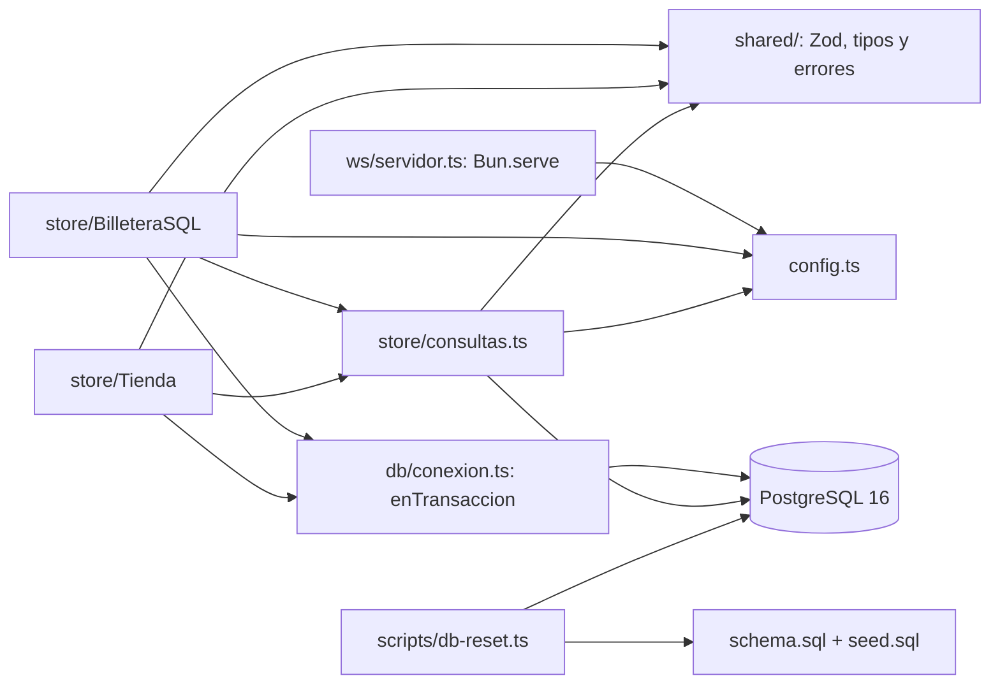
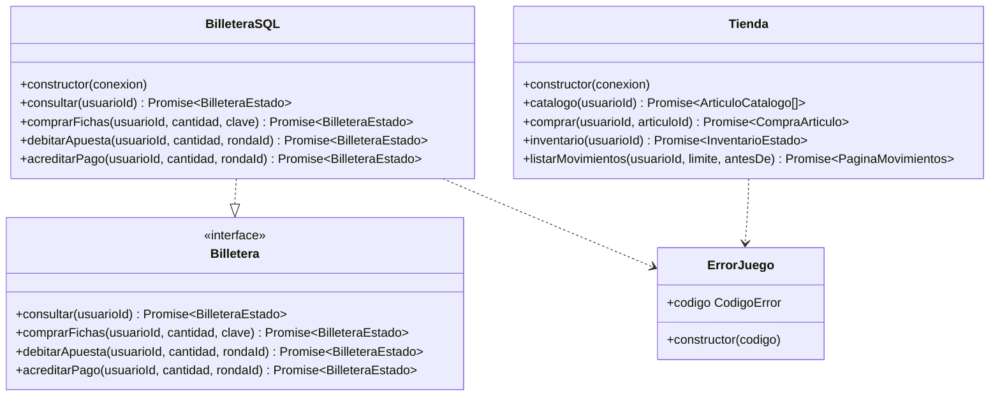
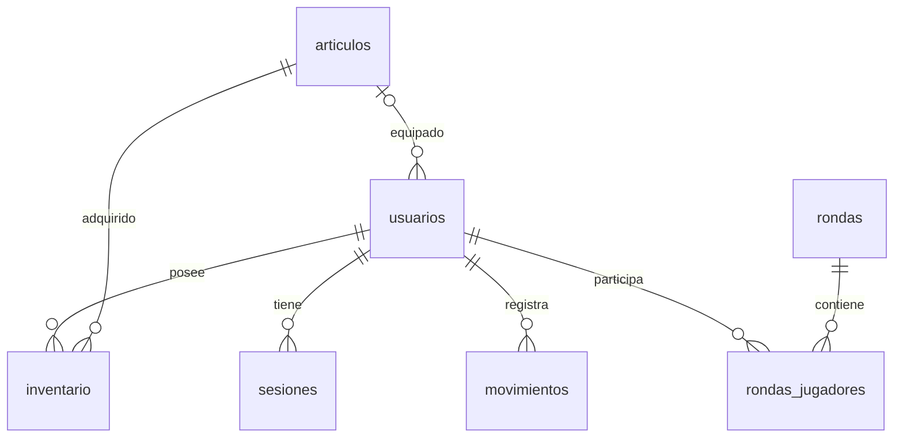
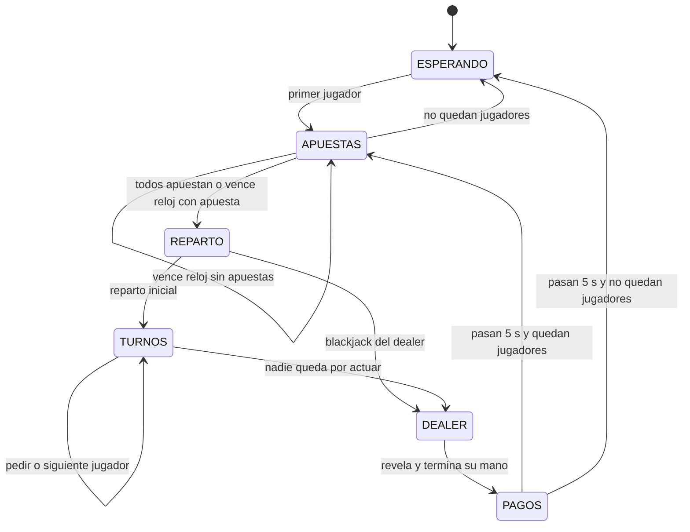

# Arquitectura de Blackjack Troyano

Documento de implementación local, 4 de octubre de 2026. El diseño completo está en [PLAN.md](../documentation/PLAN.md); las tareas y sus criterios de aceptación están en [TAREAS.md](../documentation/TAREAS.md). Este borrador cubre la base disponible para T-32/T-50. Requiere actualizarse después del motor de juego y la revisión de Hector.

## Módulos disponibles y pendientes

| Módulo | Implementación disponible | Integración pendiente |
|---|---|---|
| `shared/` | Esquemas Zod, tipos inferidos, códigos/mensajes españoles y `ErrorJuego` | Uso por el enrutador y la capa de red real |
| `server/src/ws/servidor.ts` | `Bun.serve`, `/ws`, topic `lobby`, conteo `bienvenida` | Enrutamiento, sesión, límite de tamaño/ritmo y acciones |
| `server/src/db/conexion.ts` | Pool PostgreSQL de Bun y `enTransaccion` | Inicialización y cierre desde el servidor |
| `server/src/store/` | Interfaz `Billetera`, `BilleteraSQL`, `Tienda` y consultas de saldo/historial | Handlers WebSocket, publicación de respuestas y equipamiento |
| `server/db/` | Siete tablas e índices, catálogo de 14 artículos | Uso por autenticación y persistencia de rondas |
| `scripts/db-reset.ts` | Recreación atómica de tablas del proyecto con confirmación de destino | Instalación independiente según manual |
| `client/` | Workspace TypeScript mínimo | Vite/React/Tailwind, pantallas, mocks y reconexión |
| `server/src/auth/`, `server/src/game/` | Diseño documentado | Sesiones, clases del juego y máquina de estados |

Los servicios de economía se pueden invocar y probar directamente contra PostgreSQL. La implementación del transporte actual solo publica `bienvenida`: todavía no permite comprar ni jugar desde un navegador. Las instrucciones disponibles están en [manual-instalacion.md](manual-instalacion.md).

## Dependencias implementadas

`shared/` no depende de Bun ni del servidor; se importa desde ambos workspaces como `@blackjack/shared`. Los tipos de mensajes se infieren de Zod. La interfaz `Billetera` solo importa tipos compartidos; permite que el juego reciba una implementación falsa en memoria para sus pruebas.

## Clases y firmas actuales

`CompraArticulo` contiene `{inventario, billetera}`; `PaginaMovimientos`, `{items, hayMas}`. `Tienda` y `BilleteraSQL` comparten consultas y transacciones, sin que una clase invoque a la otra. `equipar` aún requiere a `GestorMesas` para validar la fase y publicar el nuevo snapshot; no se declara como método implementado.

Las clases previstas `Carta`, `Baraja`, `Mano`, `Jugador`, `Dealer`, `Mesa`, `GestorMesas`, `Sesiones` y `Enrutador` se describen en PLAN §5. Todavía no existen en el código y deben incorporarse a este diagrama conforme se implementen.

## Persistencia

Fuentes ejecutables: [schema.sql](../server/db/schema.sql) y [seed.sql](../server/db/seed.sql). `db:reset` aplica ambos dentro de una transacción; un fallo revierte la recreación. El catálogo incluye cinco avatares, cinco reversos y cuatro temas, incluidos los tres gratuitos.

| Tabla | Datos y restricciones principales |
|---|---|
| `articulos` | ID textual, tipo `avatar/reverso/tema`, precio entero no negativo y venta activa |
| `usuarios` | Usuario único de 3–20 caracteres, hash, dinero/fichas no negativos y referencias a los tres cosméticos equipados |
| `sesiones` | Token de 64 caracteres, usuario, creación y expiración; eliminación en cascada al borrar usuario |
| `inventario` | Posesión de artículos; PK compuesta impide duplicar un artículo para el usuario |
| `movimientos` | Libro contable con deltas, saldos posteriores, referencia, fecha y clave de compra; prohíbe deltas ambos cero |
| `rondas` | UUID, mesa, tiempos y mano final del dealer; solo rondas terminadas |
| `rondas_jugadores` | Jugador/asiento, cartas, total, apuesta, resultado y pago; PK por ronda/usuario |

Índices: `(usuario_id, tipo, creado_en)` para compras del día e historial; `UNIQUE (usuario_id, clave) WHERE clave IS NOT NULL` para idempotencia. Las FK garantizan existencia del artículo equipado; autenticación/equipamiento deben garantizar además su tipo y posesión.

El libro contable se trata como solo inserciones en la aplicación. El esquema no incluye un trigger que impida editarlo mediante acceso SQL administrativo; `db:reset` sí lo borra para preparar una base de desarrollo.

## Transacciones y cantidades

Toda operación monetaria bloquea `usuarios` con `SELECT ... FOR UPDATE`, valida los saldos y guarda saldo/movimiento en el mismo commit. Compras simultáneas del mismo usuario se serializan. Un fallo propaga el error después de rollback; ni saldo ni movimiento parcial quedan confirmados.

`debitarApuesta` escribe un delta negativo. `acreditarPago` recibe el total devuelto incluida la apuesta: victoria con apuesta 10 → 20, blackjack → 25, empate → 10, derrota → 0. Un pago de cero no actualiza saldos ni inserta movimiento: la pérdida ya quedó registrada por el débito de la apuesta. La mano y su resultado sí deben guardarse en `rondas_jugadores`, aunque su pago sea cero. Las compras de artículos gratuitos tampoco crean movimientos vacíos.

La billetera no valida el turno, la fase, una sola apuesta ni una sola liquidación por ronda. Esas garantías pertenecen a `Mesa`; deben cumplirse antes de invocar los métodos. `comprarFichas` sí incorpora idempotencia: una clave ya confirmada devuelve el saldo actual sin cobrar otra vez. El navegador conserva la misma clave al reintentar una intención y genera una nueva para una compra nueva.

El día natural se calcula en PostgreSQL usando `America/Mexico_City`. El servicio toma el reloj después de adquirir el bloqueo y reutiliza ese instante para validar el límite, fechar el movimiento y construir la respuesta; una transacción que espera cruzando medianoche cuenta en el día correcto. `disponibleHoy = max(0, limiteDiario - compradoHoy)`; `reinicioEn` es la próxima medianoche local expresada como ISO con zona.

Saldos y deltas SQL `bigint` se leen como texto y solo se convierten a números si `Number.isSafeInteger` permite representarlos exactamente. Los ID `bigserial` del historial se conservan como strings decimales hasta `9223372036854775807`. Las cantidades de compra/apuesta siguen los límites de `server/src/config.ts`.

### Contrato para el registro pendiente (T-08)

La transacción de `Sesiones.registrar` debe crear usuario con dinero inicial 10000 y fichas 500, entregar los tres artículos gratuitos, equiparlos, crear sesión e insertar un movimiento `registro` con `delta_dinero=10000`, `delta_fichas=500` y saldos posteriores iguales. Esto permite reconciliar la suma de movimientos con el saldo desde el origen. El default SQL de fichas es cero; los 500 de bienvenida deben establecerse explícitamente dentro del registro. `Tienda.inventario` rechaza con `ERROR_INTERNO` a un usuario que no tenga los tres cosméticos equipados.

Las pruebas crean sus propios usuarios y movimientos iniciales; no representan una implementación de registro ni sesiones.

## Contrato WebSocket y conexión pendiente

En [shared/protocolo.ts](../shared/protocolo.ts) hay 18 intenciones y 12 mensajes del servidor, incluidas `bienvenida`, `sesion`, snapshots, economía e historial. Todos se discriminan por `type`; `reqId?` correlaciona respuestas directas. Las publicaciones a topics omiten `reqId`.

La validación rechaza campos desconocidos y no convierte cadenas a números. Si el único error es una `cantidad` presente de `apostar`/`fichas.comprar`, `crearErrorValidacion` devuelve `CANTIDAD_INVALIDA`; los errores de estructura, cantidad faltante y tipos desconocidos devuelven `MENSAJE_INVALIDO`. `ErrorJuego(codigo)` proporciona el mensaje español para fallos de dominio. El transporte debe convertir excepciones inesperadas a `ERROR_INTERNO` y registrar sus detalles sin exponerlos al cliente.

El esquema entrante por defecto usa los límites del PLAN. El enrutador debe llamar a `crearMensajeClienteSchema` con `APUESTA_MIN`, `APUESTA_MAX`, `COMPRA_FICHAS_MIN`, `COMPRA_FICHAS_MAX` y `MULTIPLO_FICHAS` para respetar cambios de configuración. El esquema no implementa los controles de tamaño 16 KB, ritmo 20/s, autenticación o permisos: corresponden a T-07/T-37.

Los snapshots `mesa.estado` contienen los campos de `MesaEstado` directamente en la raíz. Los cinco asientos tienen índice coincidente con su posición. La carta oculta solo puede contener `{oculta:true}`, con total del dealer `null`; antes de `DEALER` hay como máximo una carta visible y en `DEALER/PAGOS` todas están reveladas.

Integración prevista de servicios:

| Intención | Llamada | Respuesta que construye el handler |
|---|---|---|
| `billetera.consultar` | `billetera.consultar(usuarioId)` | `{type:"billetera", ...estado, reqId}` |
| `fichas.comprar` | `billetera.comprarFichas(usuarioId,cantidad,clave)` | Billetera directa y publicación en `usuario:<id>` |
| `tienda.catalogo` | `tienda.catalogo(usuarioId)` | `{type:"catalogo", articulos, reqId}` |
| `tienda.comprar` | `tienda.comprar(usuarioId,articuloId)` | Inventario directo y publicaciones inventario/billetera |
| `inventario.listar` | `tienda.inventario(usuarioId)` | `{type:"inventario", ...estado, reqId}` |
| `movimientos.listar` | `tienda.listarMovimientos(usuarioId,limite,antesDe)` | `{type:"movimientos", ...pagina, reqId}` |

`usuarioId` siempre proviene de la sesión validada por el servidor. El cliente no puede enviarlo como autorización. La paginación devuelve filas por ID descendente, pide una fila extra para `hayMas` y usa como cursor exclusivo el ID de la última fila recibida.

## Máquina de estados prevista

Las fases y los snapshots ya se validan en `shared/`. Las transiciones y relojes aún dependen de T-18/T-19:

`Mesa` tendrá un solo timeout activo, reloj de apuestas 15 s y turnos 20 s. La carta oculta debe excluirse al construir el snapshot, además de ser rechazada por el contrato si aparece filtrada. La autorización de turnos y la fase de equipamiento requieren la futura conexión con `GestorMesas`.

## Verificación y cierre pendiente

`server/test/protocolo.test.ts` verifica un ejemplo válido/inválido por mensaje, tipos desconocidos, cantidades, errores públicos, IDs sin pérdida de precisión y protección del snapshot. `server/test/servidor.test.ts` comprueba conteos con tres conexiones WebSocket reales. Las pruebas de economía están en `server/test/economia.test.ts` y requieren una base PostgreSQL exclusiva de pruebas, según el manual.

Antes de cerrar T-32/T-50: agregar las clases reales del juego/auth/router, confirmar publicación de eventos y dependencias del cliente, completar equipamiento/persistencia de rondas, renderizar los diagramas en GitHub y obtener revisión de Hector. El juego desde tres laptops, los manuales independientes y el paquete final mantienen sus propios criterios de aceptación.
