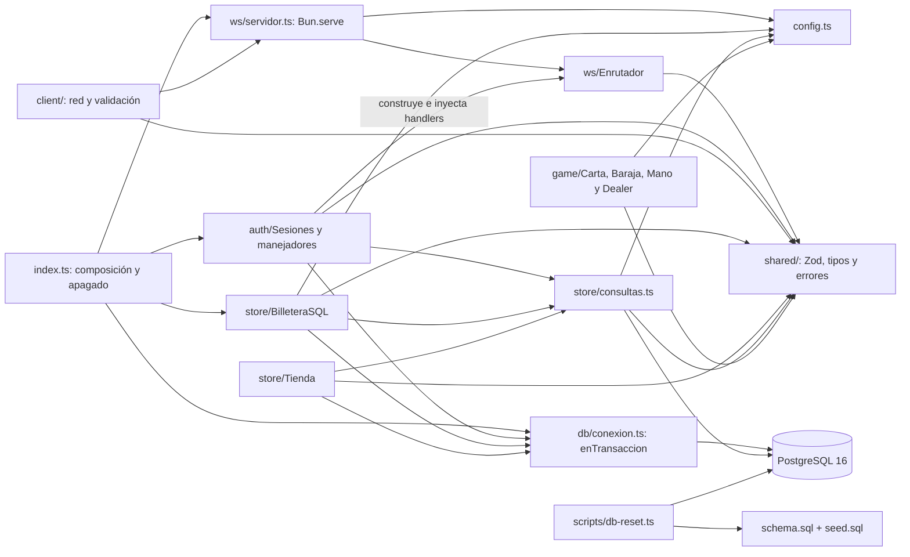
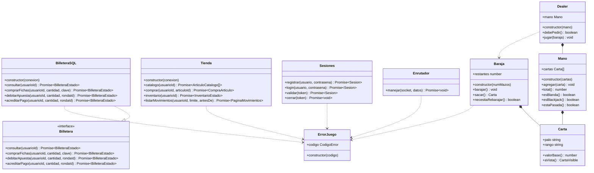
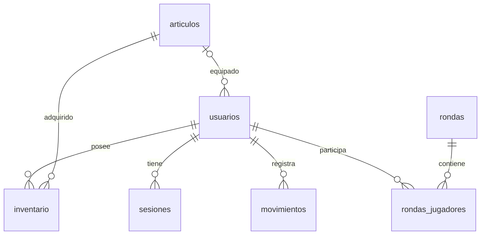
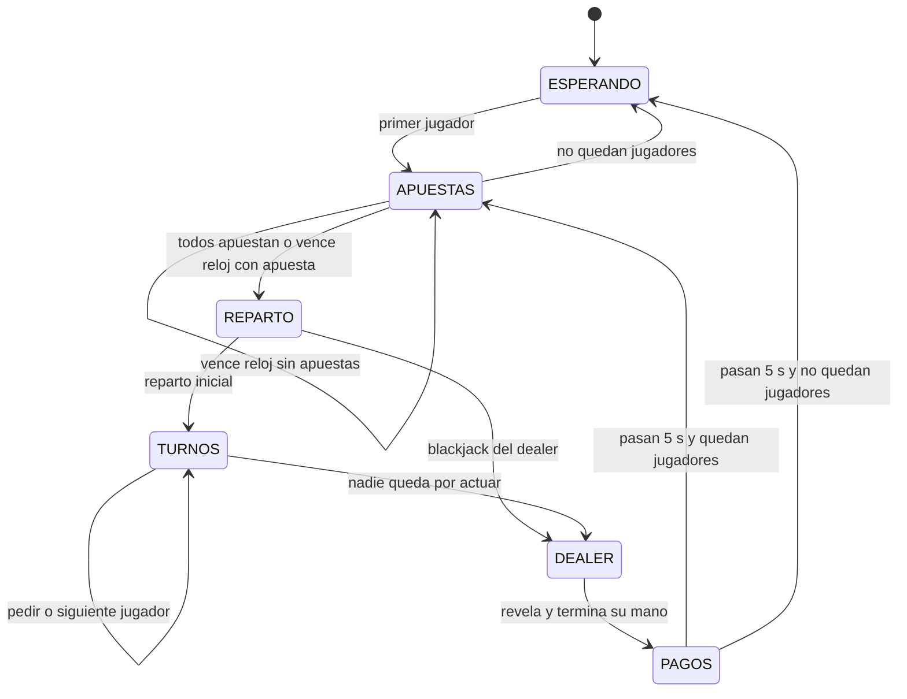

# Arquitectura de Blackjack Troyano

Documento de implementación, actualizado el 5 de octubre de 2026 CDMX sobre `main` en `af772d8`, con T-07/T-08/T-15/T-16 fusionadas (PR #18/#19/#25/#27). El diseño completo está en [PLAN.md](../documentation/PLAN.md); las tareas y sus criterios de aceptación están en [TAREAS.md](../documentation/TAREAS.md). El cliente, el contrato, la autenticación, Carta/Baraja y Mano/Dealer están en `main`; faltan el motor de mesa y la revisión final de Hector.

## Módulos disponibles y pendientes

| Módulo | Implementación disponible | Integración pendiente |
|---|---|---|
| `shared/` | Esquemas Zod, tipos inferidos, errores y límites únicos, consumidos por cliente y enrutador | Contratos del juego listos para sus handlers |
| `server/src/ws/` | `Bun.serve`, `/ws`, `bienvenida`, `Enrutador`, validación UTF-8 de 16 KB, reqId, errores y cola por conexión | Límite de ritmo, handlers de mesas y compras |
| `server/src/db/conexion.ts` | Pool PostgreSQL de Bun y `enTransaccion`; creado en index y cerrado al detener el servidor | Instalación independiente |
| `server/src/store/` | Interfaz `Billetera`, `BilleteraSQL`, `Tienda` y consultas de saldo/historial | Handlers WebSocket, publicación de respuestas y equipamiento |
| `server/db/` | Siete tablas e índices, catálogo de 14 artículos; usuarios/sesiones/inventario/ledger usados por auth | Persistencia de rondas |
| `scripts/db-reset.ts` | Recreación atómica de tablas del proyecto con confirmación de destino | Instalación independiente según manual |
| `client/` | Vite/React/Tailwind, red/reconexión/reqId, pantallas y mock; catálogo de solo lectura en mock (T-12) | Lobby y partidas reales, verificación de reconexión cliente, compras/historial e inventario completos |
| `server/src/auth/` | `Sesiones` y adaptador autenticado: registro atómico, login, reanudar, logout, vigencia/revocación antes de cada intención protegida | Recuperación de asiento cuando exista el juego |
| `server/src/game/` | `Carta` inmutable, `Baraja` de cuatro mazos y `Mano`/`Dealer` con As flexible (T-15/T-16) | GestorMesas, Mesa y máquina de estados |

El servidor disponible en `main` permite autenticar y consultar la billetera por WebSocket. Compras, inventario e historial tienen servicios SQL probados y esperan sus handlers; el lobby y las partidas requieren `GestorMesas` y el motor. El cliente cubre la interfaz completa con el mock. Las instrucciones disponibles están en [manual-instalacion.md](manual-instalacion.md).

## Dependencias implementadas

`shared/` no depende de Bun ni del servidor; se importa desde ambos workspaces como `@blackjack/shared`. Los tipos de mensajes se infieren de Zod. La interfaz `Billetera` solo importa tipos compartidos; permite que el juego reciba una implementación falsa en memoria para sus pruebas.

## Clases y firmas actuales

`CompraArticulo` contiene `{inventario, billetera}`; `PaginaMovimientos`, `{items, hayMas}`. `Tienda` y `BilleteraSQL` comparten consultas y transacciones, sin que una clase invoque a la otra. `equipar` aún requiere a `GestorMesas` para validar la fase y publicar el nuevo snapshot; no se declara como método implementado.

`Carta`/`Baraja` y `Mano`/`Dealer` están implementadas desde PR #25/#27; las firmas del diagrama corresponden a sus archivos reales. `Mano` distingue el blackjack natural de un 21 con tres cartas y `Dealer` se planta también en 17 blando. Las clases previstas `Jugador`, `Mesa` y `GestorMesas` se describen en PLAN §5 y se incorporarán cuando se fusionen. La dependencia de autenticación hacia el enrutador está en la función `crearEnrutadorAutenticado` de `auth/manejadores.ts`, que importa y construye `Enrutador`. La clase `Sesiones` no depende de `Enrutador`, y `Enrutador` no importa SQL ni clases de autenticación.

## Persistencia

Fuentes ejecutables: [schema.sql](../server/db/schema.sql) y [seed.sql](../server/db/seed.sql). `db:reset` aplica ambos dentro de una transacción; un fallo revierte la recreación. El catálogo incluye cinco avatares, cinco reversos y cuatro temas, incluidos los tres gratuitos.

| Tabla | Datos y restricciones principales |
|---|---|
| `articulos` | ID textual, tipo `avatar/reverso/tema`, precio entero no negativo y venta activa |
| `usuarios` | Usuario único de 3–20 caracteres, hash, dinero/fichas no negativos y referencias a los tres cosméticos equipados |
| `sesiones` | Token de 64 caracteres, usuario, creación y expiración; eliminación en cascada al borrar usuario |
| `inventario` | Posesión de artículos; PK compuesta impide duplicar un artículo para el usuario |
| `movimientos` | Libro contable con deltas, saldos posteriores, referencia, fecha y clave de compra; prohíbe deltas ambos cero |
| `rondas` | UUID, mesa, tiempos y mano final del dealer; solo rondas terminadas |
| `rondas_jugadores` | Jugador/asiento, cartas, total, apuesta, resultado y pago; PK por ronda/usuario |

Índices: `(usuario_id, tipo, creado_en)` para compras del día e historial; `UNIQUE (usuario_id, clave) WHERE clave IS NOT NULL` para idempotencia. Las FK garantizan existencia del artículo equipado; autenticación/equipamiento deben garantizar además su tipo y posesión.

El libro contable se trata como solo inserciones en la aplicación. El esquema no incluye un trigger que impida editarlo mediante acceso SQL administrativo; `db:reset` sí lo borra para preparar una base de desarrollo.

### Diccionario de columnas

Los tipos y restricciones siguientes corresponden a `server/db/schema.sql`. `PK` identifica la clave primaria; `FK`, una referencia a otra tabla. Las fechas usan `timestamptz`.

**articulos**

| Columna | Tipo | Uso y restricciones |
|---|---|---|
| `id` | varchar(40) | PK; identificador estable del catálogo |
| `tipo` | varchar(10) | Obligatorio; avatar, reverso o tema |
| `nombre` | varchar(60) | Nombre visible obligatorio |
| `precio` | integer | Fichas requeridas, obligatorio y no negativo |
| `activo` | boolean | Disponible para venta; obligatorio, true por defecto |

**usuarios**

| Columna | Tipo | Uso y restricciones |
|---|---|---|
| `id` | serial | PK; identidad interna generada |
| `usuario` | varchar(20) | Obligatorio y único; 3–20 letras ASCII, dígitos o guion bajo |
| `hash` | text | Hash Argon2id obligatorio; nunca se envía al cliente |
| `dinero` | bigint | Dinero simulado; obligatorio, no negativo, 10000 por defecto |
| `fichas` | bigint | Saldo disponible; obligatorio, no negativo, cero por defecto SQL; registro asigna 500 |
| `avatar_id` | varchar(40) | FK a articulos; avatar equipado |
| `reverso_id` | varchar(40) | FK a articulos; reverso equipado |
| `tema_id` | varchar(40) | FK a articulos; tema local equipado |
| `creado_en` | timestamptz | Fecha obligatoria; now() por defecto |

**sesiones**

| Columna | Tipo | Uso y restricciones |
|---|---|---|
| `token` | char(64) | PK; 32 bytes aleatorios codificados en hexadecimal por auth |
| `usuario_id` | integer | FK obligatoria a usuarios; se elimina la sesión al borrar el usuario |
| `creado_en` | timestamptz | Fecha obligatoria; now() por defecto |
| `expira_en` | timestamptz | Vencimiento obligatorio; auth asigna siete días |

**inventario**

| Columna | Tipo | Uso y restricciones |
|---|---|---|
| `usuario_id` | integer | FK a usuarios; parte de PK; posesiones eliminadas con el usuario |
| `articulo_id` | varchar(40) | FK a articulos; parte de PK; un artículo por usuario |
| `adquirido_en` | timestamptz | Fecha obligatoria; now() por defecto |

**movimientos**

| Columna | Tipo | Uso y restricciones |
|---|---|---|
| `id` | bigserial | PK; orden del historial; se transmite como string |
| `usuario_id` | integer | FK obligatoria al dueño del saldo |
| `tipo` | varchar(20) | Obligatorio; registro, compra_fichas, apuesta, pago o compra_articulo |
| `delta_dinero` | bigint | Cambio de dinero obligatorio; cero por defecto |
| `delta_fichas` | bigint | Cambio de fichas obligatorio; cero por defecto; ambos deltas no pueden ser cero |
| `dinero_despues` | bigint | Saldo de dinero posterior obligatorio y no negativo |
| `fichas_despues` | bigint | Saldo de fichas posterior obligatorio y no negativo |
| `referencia` | varchar(80) | Ronda o artículo asociado; puede ser null |
| `clave` | varchar(64) | Compra idempotente; única por usuario cuando no es null |
| `creado_en` | timestamptz | Fecha obligatoria; now() por defecto; compras fijan el reloj usado para el límite |

**rondas** (persistencia preparada para T-21)

| Columna | Tipo | Uso y restricciones |
|---|---|---|
| `id` | uuid | PK; identificador generado por el motor |
| `mesa_id` | varchar(20) | Identificador obligatorio de mesa en memoria; no hay FK a una tabla de mesas |
| `iniciada_en` | timestamptz | Inicio obligatorio |
| `terminada_en` | timestamptz | Fin obligatorio; solo se guardan rondas terminadas |
| `cartas_dealer` | jsonb | Mano final obligatoria; formato de cartas validado por el código |
| `total_dealer` | smallint | Total final obligatorio |

**rondas_jugadores** (persistencia preparada para T-21)

| Columna | Tipo | Uso y restricciones |
|---|---|---|
| `ronda_id` | uuid | FK a rondas y parte de PK |
| `usuario_id` | integer | FK a usuarios y parte de PK; una fila por jugador/ronda |
| `asiento` | smallint | Obligatorio; entre 0 y 4 |
| `apuesta` | integer | Obligatoria y mayor que cero |
| `cartas` | jsonb | Mano final obligatoria |
| `total` | smallint | Total final obligatorio |
| `resultado` | varchar(10) | Obligatorio; blackjack, gana, empate, pierde o pasado |
| `pago` | integer | Total devuelto, incluida la apuesta; obligatorio y no negativo |

## Transacciones y cantidades

Toda operación monetaria bloquea `usuarios` con `SELECT ... FOR UPDATE`, valida los saldos y guarda saldo/movimiento en el mismo commit. Compras simultáneas del mismo usuario se serializan. Un fallo propaga el error después de rollback; ni saldo ni movimiento parcial quedan confirmados.

`debitarApuesta` escribe un delta negativo. `acreditarPago` recibe el total devuelto incluida la apuesta: victoria con apuesta 10 → 20, blackjack → 25, empate → 10, derrota → 0. Un pago de cero no actualiza saldos ni inserta movimiento: la pérdida ya quedó registrada por el débito de la apuesta. La mano y su resultado sí deben guardarse en `rondas_jugadores`, aunque su pago sea cero. Las compras de artículos gratuitos tampoco crean movimientos vacíos.

La billetera no valida el turno, la fase, una sola apuesta ni una sola liquidación por ronda. Esas garantías pertenecen a `Mesa`; deben cumplirse antes de invocar los métodos. `comprarFichas` sí incorpora idempotencia: una clave ya confirmada devuelve el saldo actual sin cobrar otra vez. El navegador conserva la misma clave al reintentar una intención y genera una nueva para una compra nueva.

El día natural se calcula en PostgreSQL usando `America/Mexico_City`. El servicio toma el reloj después de adquirir el bloqueo y reutiliza ese instante para validar el límite, fechar el movimiento y construir la respuesta; una transacción que espera cruzando medianoche cuenta en el día correcto. `disponibleHoy = max(0, limiteDiario - compradoHoy)`; `reinicioEn` es la próxima medianoche local expresada como ISO con zona.

Saldos y deltas SQL `bigint` se leen como texto y solo se convierten a números si `Number.isSafeInteger` permite representarlos exactamente. Los ID `bigserial` del historial se conservan como strings decimales hasta `9223372036854775807`. Las cantidades de compra/apuesta siguen los límites de `server/src/config.ts`.

### Registro atómico implementado (T-08)

La transacción de `Sesiones.registrar` crea usuario con dinero inicial 10000 y fichas 500, entrega los tres artículos gratuitos, los equipa, crea sesión e inserta un movimiento `registro` con `delta_dinero=10000`, `delta_fichas=500` y saldos posteriores iguales. Esto permite reconciliar la suma de movimientos con el saldo desde el origen. El default SQL de fichas es cero; el registro establece explícitamente los 500 de bienvenida. `Tienda.inventario` rechaza con `ERROR_INTERNO` a un usuario que no tenga los tres cosméticos equipados.

Las contraseñas se guardan como Argon2id; los tokens contienen 32 bytes aleatorios y expiran en siete días. El adaptador asocia identidad al socket después de validar SQL y comprueba la vigencia antes de cada intención protegida. La cola del enrutador conserva el orden de registro/login/logout en una conexión. `mesaId` sigue siendo null hasta integrar las mesas.

La suite de economía prepara usuarios y movimientos propios en su esquema aislado; la suite de autenticación ejercita el registro y las sesiones reales mediante SQL y sockets.

## Contrato WebSocket e integración

En [shared/protocolo.ts](../shared/protocolo.ts) hay 18 intenciones y 12 mensajes del servidor, incluidas `bienvenida`, `sesion`, snapshots, economía e historial. Todos se discriminan por `type`; `reqId?` correlaciona respuestas directas. Las publicaciones a topics omiten `reqId`.

La validación rechaza campos desconocidos y no convierte cadenas a números. Si el único error es una `cantidad` presente de `apostar`/`fichas.comprar`, `crearErrorValidacion` devuelve `CANTIDAD_INVALIDA`; los errores de estructura, cantidad faltante y tipos desconocidos devuelven `MENSAJE_INVALIDO`. `ErrorJuego(codigo)` proporciona el mensaje español para fallos de dominio. El enrutador convierte excepciones inesperadas a `ERROR_INTERNO` y registra sus detalles sin exponerlos al cliente.

Los límites de apuesta y compra se definen una sola vez en `LIMITES_CANTIDAD` (`shared/protocolo.ts`). `MensajeClienteSchema` los aplica, el cliente los usa en sus formularios y `server/src/config.ts` los re-exporta para `BilleteraSQL`, así que el enrutador usa `MensajeClienteSchema` directamente. El tamaño de 16 KB ya se controla en `Enrutador` (T-07), y el adaptador de auth valida la sesión antes de cada intención protegida (T-08). Los permisos de fase/turno esperan el motor; el límite de ritmo de 20/s sigue pendiente en T-37. Esos controles pertenecen al servidor, fuera del esquema Zod.

Los snapshots `mesa.estado` contienen los campos de `MesaEstado` directamente en la raíz. Los cinco asientos tienen índice coincidente con su posición. La carta oculta solo puede contener `{oculta:true}`, con total del dealer `null`; antes de `DEALER` hay como máximo una carta visible y en `DEALER/PAGOS` todas están reveladas.

Integración de servicios (consulta de billetera disponible en `main`; demás handlers pendientes):

| Intención | Llamada | Respuesta que construye el handler |
|---|---|---|
| `billetera.consultar` | `billetera.consultar(usuarioId)` | `{type:"billetera", ...estado, reqId}` |
| `fichas.comprar` | `billetera.comprarFichas(usuarioId,cantidad,clave)` | Billetera directa y publicación en `usuario:<id>` |
| `tienda.catalogo` | `tienda.catalogo(usuarioId)` | `{type:"catalogo", articulos, reqId}` |
| `tienda.comprar` | `tienda.comprar(usuarioId,articuloId)` | Inventario directo y publicaciones inventario/billetera |
| `inventario.listar` | `tienda.inventario(usuarioId)` | `{type:"inventario", ...estado, reqId}` |
| `movimientos.listar` | `tienda.listarMovimientos(usuarioId,limite,antesDe)` | `{type:"movimientos", ...pagina, reqId}` |

`usuarioId` siempre proviene de la sesión validada por el servidor. El cliente no puede enviarlo como autorización. La paginación devuelve filas por ID descendente, pide una fila extra para `hayMas` y usa como cursor exclusivo el ID de la última fila recibida.

## Máquina de estados prevista

Las fases y los snapshots ya se validan en `shared/`. Las transiciones y relojes aún dependen de T-18/T-19:

`Mesa` tendrá un solo timeout activo, reloj de apuestas 15 s y turnos 20 s. La carta oculta debe excluirse al construir el snapshot, además de ser rechazada por el contrato si aparece filtrada. La autorización de turnos y la fase de equipamiento requieren la futura conexión con `GestorMesas`.

## Verificación y cierre pendiente

`server/test/protocolo.test.ts` verifica un ejemplo válido/inválido por mensaje, tipos desconocidos, cantidades, errores públicos, IDs sin pérdida de precisión y protección del snapshot. `server/test/servidor.test.ts` comprueba conteos con tres conexiones WebSocket reales. `enrutador.test.ts` cubre mensajes malformados, tamaño UTF-8, correlación y continuidad del servidor; `autenticacion.test.ts`, registro atómico, credenciales, revocación y recuperación de sesiones persistentes. `baraja.test.ts` verifica Carta/Baraja, extracción sin reemplazo y el umbral de 52/51. `mano.test.ts` cubre dieciséis casos de Ases, natural, pasadas y regla del dealer. Las pruebas de economía están en `economia.test.ts`; economía/auth requieren PostgreSQL de pruebas, según el manual.

Antes de cerrar T-32/T-50: incorporar las clases reales de mesa/gestor y su integración cuando se fusionen, confirmar publicación de eventos y dependencias del cliente, completar equipamiento/persistencia de rondas, renderizar los diagramas en GitHub y obtener revisión de Hector. Auth, router, Carta/Baraja y Mano/Dealer ya se describen aquí. El juego desde tres laptops, los manuales independientes y el paquete final mantienen sus propios criterios de aceptación.
