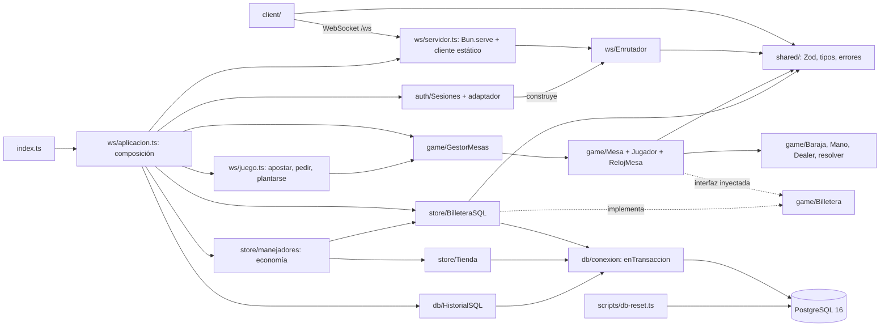
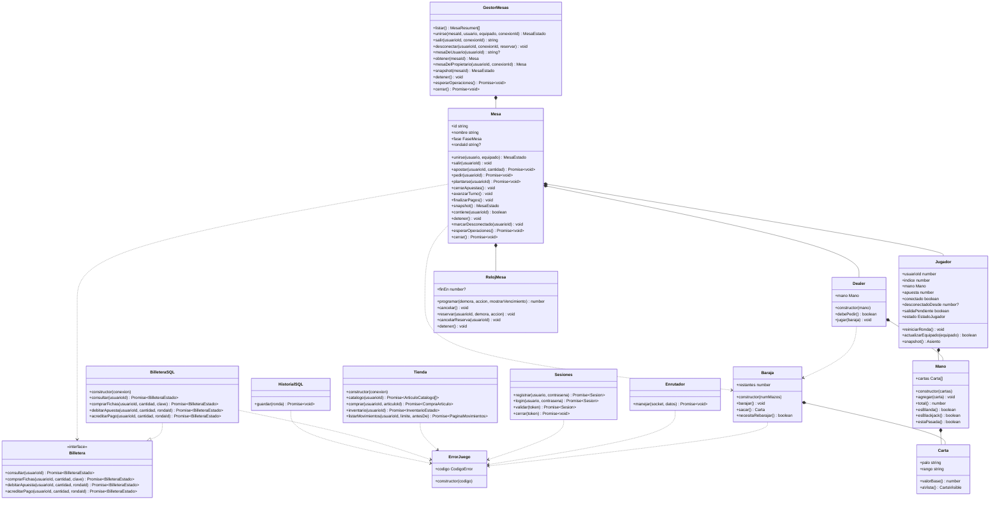
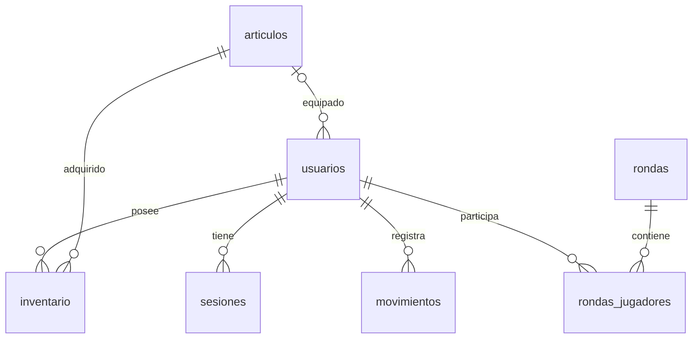
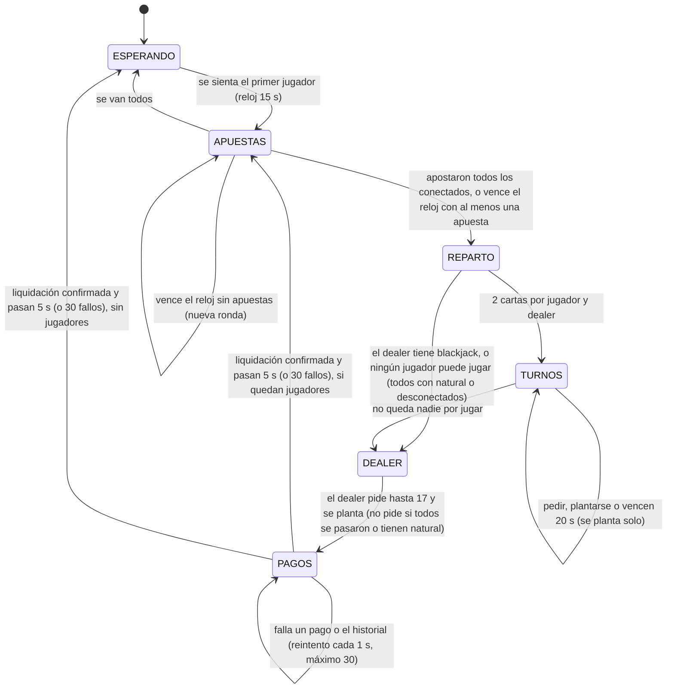

# Arquitectura de Blackjack Troyano

Documento de implementación, actualizado el 6 de octubre de 2026 CDMX. Describe `main` en `8bfe554`, con el motor de partidas (T-18 a T-21, PR #29–#32), bots T-26 y recuperación de asiento T-36 (#37 integrado con #33). Revisión de contenido por Hector el 6 oct; renderizado en GitHub y exportaciones para el ZIP pendientes. El diseño original está en [PLAN.md](../documentation/PLAN.md) y los criterios de aceptación en [TAREAS.md](../documentation/TAREAS.md).

## Módulos

| Módulo | Contenido |
|---|---|
| `shared/` | Esquemas Zod de los 18 mensajes del cliente y los 12 del servidor, tipos inferidos, códigos de error en español y límites de cantidades. Lo importan cliente y servidor. |
| `server/src/ws/` | `Bun.serve` en un solo puerto (`servidor.ts`, `clienteEstatico.ts`), `Enrutador` (JSON, Zod, 16 KB, `reqId`, `try/catch` global), composición de la aplicación (`aplicacion.ts`) y handlers de juego (`juego.ts`). |
| `server/src/auth/` | `Sesiones` (Argon2id, tokens de 7 días, registro atómico) y el adaptador que exige sesión antes de cada intención protegida. |
| `server/src/game/` | Motor en memoria: `Carta`, `Baraja`, `Mano`, `Dealer`, `Jugador`, `Mesa`, `RelojMesa`, `GestorMesas`, la función `resolver` y la interfaz `Billetera`. No importa `store/` ni `db/`. |
| `server/src/store/` | `BilleteraSQL`, `Tienda`, consultas de saldo e historial y handlers de economía. |
| `server/src/db/` | Pool PostgreSQL de Bun, `enTransaccion` y `HistorialSQL` (rondas terminadas). |
| `server/db/` | `schema.sql` (7 tablas) y `seed.sql` (14 artículos). |
| `scripts/` | `db-reset.ts`, `dev.ts`, `empaquetar.ts` y `verificar-mesa.ts` (verificación manual de la mesa). `bots.ts` (jugadores automáticos) está integrado desde #33. |
| `client/` | React + Vite + Tailwind: capa de red con reconexión, estado, pantallas, componentes de mesa y servidor falso (`?mock=1`). |

## Dependencias implementadas

`aplicacion.ts` es el único lugar que conoce a la vez SQL y el motor: crea `BilleteraSQL` y `HistorialSQL` y se los inyecta a `GestorMesas` como `ServiciosMesa`. Así `game/` se prueba con `BilleteraMemoria` y relojes falsos, sin base de datos.

`shared/` no depende de Bun ni del servidor; se importa desde ambos workspaces como `@blackjack/shared`. Los tipos de mensajes se infieren de Zod. La interfaz `Billetera` solo importa tipos compartidos; permite que el juego reciba una implementación falsa en memoria para sus pruebas.

## Clases y firmas actuales

`CompraArticulo` contiene `{inventario, billetera}`; `PaginaMovimientos`, `{items, hayMas}`. `Tienda` y `BilleteraSQL` comparten consultas y transacciones, sin que una clase invoque a la otra.

La interfaz `Billetera` vive en `game/Billetera.ts`, y `store/Billetera.ts` solo la reexporta. Así el motor define lo que necesita y `store/` lo implementa, sin que `game/` importe `store/`. `resolver(mano, manoDealer, apuesta)` en `game/reglas.ts` es una función pura que devuelve `{resultado, pago}`; el pago incluye la apuesta (blackjack 10 → 25, gana 10 → 20, empate 10 → 10, pierde → 0).

`GestorMesas` garantiza un solo asiento por usuario y una sola conexión dueña del asiento. Si el mismo usuario abre la mesa en otra pestaña, la nueva toma el asiento y la anterior recibe un aviso `NO_ESTAS_EN_MESA` sin `reqId` y queda como espectadora (PLAN §7.5): conserva su suscripción y sigue recibiendo snapshots, pero sus acciones se rechazan con `NO_ESTAS_EN_MESA`. Puede enviar `mesa.salir` para desuscribirse sin liberar el asiento ajeno. Un cierre tardío de la pestaña vieja no afecta al nuevo dueño, porque cada operación lleva el `conexionId`. Al reanudar sesión, si el usuario todavía tiene asiento, el servidor lo vuelve a suscribir a su mesa y le envía el snapshot.

`Mesa` serializa todas sus operaciones con una cola de promesas (`encolar`): las acciones de jugadores, los vencimientos del reloj y la liquidación nunca se ejecutan intercalados. Cada vencimiento comprueba que la fase, la ronda y el turno sigan siendo los mismos que cuando se programó; un reloj viejo no puede mover una ronda nueva.

`equipar` no está implementado. El alcance de entrega se define en [PLAN §10](../documentation/PLAN.md#10-criterio-de-corte).

## Persistencia

Fuentes ejecutables: [schema.sql](../server/db/schema.sql) y [seed.sql](../server/db/seed.sql). `db:reset` aplica ambos dentro de una transacción; un fallo revierte la recreación. El catálogo incluye cinco avatares, cinco reversos y cuatro temas, incluidos los tres gratuitos.

| Tabla | Datos y restricciones principales |
|---|---|
| `articulos` | ID textual, tipo `avatar/reverso/tema`, precio entero no negativo y venta activa |
| `usuarios` | Usuario único de 3–20 caracteres, hash, dinero/fichas no negativos y referencias a los tres cosméticos equipados |
| `sesiones` | Token de 64 caracteres, usuario, creación y expiración; eliminación en cascada al borrar usuario |
| `inventario` | Posesión de artículos; PK compuesta impide duplicar un artículo para el usuario |
| `movimientos` | Libro contable con deltas, saldos posteriores, referencia, fecha y clave de compra; prohíbe deltas ambos cero |
| `rondas` | UUID, mesa, tiempos y mano final del dealer; solo rondas terminadas |
| `rondas_jugadores` | Jugador/asiento, cartas, total, apuesta, resultado y pago; PK por ronda/usuario |

Índices: `(usuario_id, tipo, creado_en)` para compras del día e historial; `UNIQUE (usuario_id, clave) WHERE clave IS NOT NULL` para idempotencia. Las FK garantizan existencia del artículo equipado; autenticación/equipamiento deben garantizar además su tipo y posesión.

El libro contable se trata como solo inserciones en la aplicación. El esquema no incluye un trigger que impida editarlo mediante acceso SQL administrativo; `db:reset` sí lo borra para preparar una base de desarrollo.

### Diccionario de columnas

Los tipos y restricciones siguientes corresponden a `server/db/schema.sql`. `PK` identifica la clave primaria; `FK`, una referencia a otra tabla. Las fechas usan `timestamptz`.

**articulos**

| Columna | Tipo | Uso y restricciones |
|---|---|---|
| `id` | varchar(40) | PK; identificador estable del catálogo |
| `tipo` | varchar(10) | Obligatorio; avatar, reverso o tema |
| `nombre` | varchar(60) | Nombre visible obligatorio |
| `precio` | integer | Fichas requeridas, obligatorio y no negativo |
| `activo` | boolean | Disponible para venta; obligatorio, true por defecto |

**usuarios**

| Columna | Tipo | Uso y restricciones |
|---|---|---|
| `id` | serial | PK; identidad interna generada |
| `usuario` | varchar(20) | Obligatorio y único; 3–20 letras ASCII, dígitos o guion bajo |
| `hash` | text | Hash Argon2id obligatorio; nunca se envía al cliente |
| `dinero` | bigint | Dinero simulado; obligatorio, no negativo, 10000 por defecto |
| `fichas` | bigint | Saldo disponible; obligatorio, no negativo, cero por defecto SQL; registro asigna 500 |
| `avatar_id` | varchar(40) | FK a articulos; avatar equipado |
| `reverso_id` | varchar(40) | FK a articulos; reverso equipado |
| `tema_id` | varchar(40) | FK a articulos; tema local equipado |
| `creado_en` | timestamptz | Fecha obligatoria; now() por defecto |

**sesiones**

| Columna | Tipo | Uso y restricciones |
|---|---|---|
| `token` | char(64) | PK; 32 bytes aleatorios codificados en hexadecimal por auth |
| `usuario_id` | integer | FK obligatoria a usuarios; se elimina la sesión al borrar el usuario |
| `creado_en` | timestamptz | Fecha obligatoria; now() por defecto |
| `expira_en` | timestamptz | Vencimiento obligatorio; auth asigna siete días |

**inventario**

| Columna | Tipo | Uso y restricciones |
|---|---|---|
| `usuario_id` | integer | FK a usuarios; parte de PK; posesiones eliminadas con el usuario |
| `articulo_id` | varchar(40) | FK a articulos; parte de PK; un artículo por usuario |
| `adquirido_en` | timestamptz | Fecha obligatoria; now() por defecto |

**movimientos**

| Columna | Tipo | Uso y restricciones |
|---|---|---|
| `id` | bigserial | PK; orden del historial; se transmite como string |
| `usuario_id` | integer | FK obligatoria al dueño del saldo |
| `tipo` | varchar(20) | Obligatorio; registro, compra_fichas, apuesta, pago o compra_articulo |
| `delta_dinero` | bigint | Cambio de dinero obligatorio; cero por defecto |
| `delta_fichas` | bigint | Cambio de fichas obligatorio; cero por defecto; ambos deltas no pueden ser cero |
| `dinero_despues` | bigint | Saldo de dinero posterior obligatorio y no negativo |
| `fichas_despues` | bigint | Saldo de fichas posterior obligatorio y no negativo |
| `referencia` | varchar(80) | Ronda o artículo asociado; puede ser null |
| `clave` | varchar(64) | Compra idempotente; única por usuario cuando no es null |
| `creado_en` | timestamptz | Fecha obligatoria; now() por defecto; compras fijan el reloj usado para el límite |

**rondas** (escrita por `HistorialSQL` al liquidar)

| Columna | Tipo | Uso y restricciones |
|---|---|---|
| `id` | uuid | PK; identificador generado por el motor |
| `mesa_id` | varchar(20) | Identificador obligatorio de mesa en memoria; no hay FK a una tabla de mesas |
| `iniciada_en` | timestamptz | Inicio obligatorio |
| `terminada_en` | timestamptz | Fin obligatorio; solo se guardan rondas terminadas |
| `cartas_dealer` | jsonb | Mano final obligatoria; formato de cartas validado por el código |
| `total_dealer` | smallint | Total final obligatorio |

**rondas_jugadores** (escrita por `HistorialSQL` en la misma transacción)

| Columna | Tipo | Uso y restricciones |
|---|---|---|
| `ronda_id` | uuid | FK a rondas y parte de PK |
| `usuario_id` | integer | FK a usuarios y parte de PK; una fila por jugador/ronda |
| `asiento` | smallint | Obligatorio; entre 0 y 4 |
| `apuesta` | integer | Obligatoria y mayor que cero |
| `cartas` | jsonb | Mano final obligatoria |
| `total` | smallint | Total final obligatorio |
| `resultado` | varchar(10) | Obligatorio; blackjack, gana, empate, pierde o pasado |
| `pago` | integer | Total devuelto, incluida la apuesta; obligatorio y no negativo |

## Transacciones y cantidades

Toda operación monetaria bloquea `usuarios` con `SELECT ... FOR UPDATE`, valida los saldos y guarda saldo/movimiento en el mismo commit. Compras simultáneas del mismo usuario se serializan. Un fallo propaga el error después de rollback; ni saldo ni movimiento parcial quedan confirmados.

`debitarApuesta` escribe un delta negativo. `acreditarPago` recibe el total devuelto incluida la apuesta: victoria con apuesta 10 → 20, blackjack → 25, empate → 10, derrota → 0. Un pago de cero no actualiza saldos ni inserta movimiento: la pérdida ya quedó registrada por el débito de la apuesta. La mano y su resultado sí deben guardarse en `rondas_jugadores`, aunque su pago sea cero. Las compras de artículos gratuitos tampoco crean movimientos vacíos.

La billetera no valida el turno, la fase ni una sola apuesta por ronda. Esas garantías pertenecen a `Mesa`; deben cumplirse antes de invocar los métodos. `debitarApuesta` no es idempotente: cada llamada inserta un movimiento `apuesta`, así que `Mesa` la invoca una sola vez por jugador y ronda. `acreditarPago` sí es idempotente: usa la clave `pago:<rondaId>` en `movimientos`; repetir el mismo pago devuelve el saldo sin acreditar otra vez, y repetirlo con otra cantidad lanza `ERROR_INTERNO`. `comprarFichas` sí incorpora idempotencia: una clave ya confirmada devuelve el saldo actual sin cobrar otra vez. El navegador conserva la misma clave al reintentar una intención y genera una nueva para una compra nueva.

El día natural se calcula en PostgreSQL usando `America/Mexico_City`. El servicio toma el reloj después de adquirir el bloqueo y reutiliza ese instante para validar el límite, fechar el movimiento y construir la respuesta; una transacción que espera cruzando medianoche cuenta en el día correcto. `disponibleHoy = max(0, limiteDiario - compradoHoy)`; `reinicioEn` es la próxima medianoche local expresada como ISO con zona.

Saldos y deltas SQL `bigint` se leen como texto y solo se convierten a números si `Number.isSafeInteger` permite representarlos exactamente. Los ID `bigserial` del historial se conservan como strings decimales hasta `9223372036854775807`. Las cantidades de compra/apuesta siguen los límites de `server/src/config.ts`.

### Liquidación de una ronda (T-21)

Al terminar el dealer, `Mesa` congela la ronda en un objeto `RondaTerminada` (UUID, mesa, tiempos, mano del dealer y, por jugador, asiento, cartas, total, apuesta, resultado y pago) y la liquida en este orden:

1. `acreditarPago` para cada jugador. La garantía contra pagos dobles está en SQL: la clave `pago:<rondaId>` hace que un reintento no acredite dos veces, aunque el commit anterior se haya confirmado y su respuesta se haya perdido. Además, un conjunto en memoria evita repetir la llamada para quien ya cobró. Un pago cero no crea movimiento.
2. `HistorialSQL.guardar`: inserta `rondas` y todas sus filas de `rondas_jugadores` en una sola transacción. Es idempotente por el UUID de la ronda: si la ronda ya existe con los mismos datos no hace nada; si existe con datos distintos lanza `ERROR_INTERNO`.
3. Publica `ronda.resultado` en `mesa:<id>` y programa 5 s de resultados antes de abrir la siguiente ronda.

Si falla el paso 1 o el 2, la mesa se queda en `PAGOS` y reintenta cada `REINTENTO_PAGOS_MS` (1 s). Tras `REINTENTOS_PAGOS_MAX` (30) intentos fallidos, abandona la liquidación para no bloquear la mesa: conserva los pagos ya confirmados, registra en el log del servidor el UUID de la ronda, los usuarios sin pago confirmado y si el historial se guardó (para conciliarlo a mano), y abre la siguiente ronda. Al apagar el servidor, `Mesa.cerrar` drena la cola y hace un último intento de la liquidación pendiente; si ese intento falla, propaga el error para que quede registrado.

Las operaciones de dinero del juego pasan por la misma cola por usuario que las compras (`serializarUsuario`), así que una compra de fichas durante una mano no se intercala con el débito de la apuesta ni con el pago.

### Registro atómico implementado (T-08)

La transacción de `Sesiones.registrar` crea usuario con dinero inicial 10000 y fichas 500, entrega los tres artículos gratuitos, los equipa, crea sesión e inserta un movimiento `registro` con `delta_dinero=10000`, `delta_fichas=500` y saldos posteriores iguales. Esto permite reconciliar la suma de movimientos con el saldo desde el origen. El default SQL de fichas es cero; el registro establece explícitamente los 500 de bienvenida. `Tienda.inventario` rechaza con `ERROR_INTERNO` a un usuario que no tenga los tres cosméticos equipados.

Las contraseñas se guardan como Argon2id; los tokens contienen 32 bytes aleatorios y expiran en siete días. El adaptador asocia identidad al socket después de validar SQL y comprueba la vigencia antes de cada intención protegida. La cola del enrutador conserva el orden de registro/login/logout en una conexión. `mesaDeUsuario` permite al adaptador saber en qué mesa está cada usuario autenticado.

La suite de economía prepara usuarios y movimientos propios en su esquema aislado; la suite de autenticación ejercita el registro y las sesiones reales mediante SQL y sockets.

## Contrato WebSocket e integración

En [shared/protocolo.ts](../shared/protocolo.ts) hay 18 intenciones y 12 mensajes del servidor, incluidas `bienvenida`, `sesion`, snapshots, economía e historial. Todos se discriminan por `type`; `reqId?` correlaciona respuestas directas. Las publicaciones a topics omiten `reqId`.

La validación rechaza campos desconocidos y no convierte cadenas a números. Si el único error es una `cantidad` presente de `apostar`/`fichas.comprar`, `crearErrorValidacion` devuelve `CANTIDAD_INVALIDA`; los errores de estructura, cantidad faltante y tipos desconocidos devuelven `MENSAJE_INVALIDO`. `ErrorJuego(codigo)` proporciona el mensaje español para fallos de dominio. El enrutador convierte excepciones inesperadas a `ERROR_INTERNO` y registra sus detalles sin exponerlos al cliente.

Los límites de apuesta y compra se definen una sola vez en `LIMITES_CANTIDAD` (`shared/protocolo.ts`). `MensajeClienteSchema` los aplica, el cliente los usa en sus formularios y `server/src/config.ts` los re-exporta para `BilleteraSQL`, así que el enrutador usa `MensajeClienteSchema` directamente. El tamaño de 16 KB ya se controla en `Enrutador` (T-07), y el adaptador de auth valida la sesión antes de cada intención protegida (T-08). Fase, turno y plazo los valida `Mesa` (`FASE_INCORRECTA`, `NO_ES_TU_TURNO`, `YA_APOSTASTE`); el límite de ritmo de 20 mensajes/s sigue pendiente en T-37. Esos controles pertenecen al servidor, fuera del esquema Zod.

Los snapshots `mesa.estado` contienen los campos de `MesaEstado` directamente en la raíz. Los cinco asientos tienen índice coincidente con su posición. La carta oculta solo puede contener `{oculta:true}`, con total del dealer `null`; antes de `DEALER` hay como máximo una carta visible y en `DEALER/PAGOS` todas están reveladas.

Handlers de economía:

| Intención | Llamada | Respuesta que construye el handler |
|---|---|---|
| `billetera.consultar` | `billetera.consultar(usuarioId)` | `{type:"billetera", ...estado, reqId}` |
| `fichas.comprar` | `billetera.comprarFichas(usuarioId,cantidad,clave)` | Billetera directa y publicación en `usuario:<id>` |
| `tienda.catalogo` | `tienda.catalogo(usuarioId)` | `{type:"catalogo", articulos, reqId}` |
| `tienda.comprar` | `tienda.comprar(usuarioId,articuloId)` | Inventario directo y publicaciones inventario/billetera |
| `inventario.listar` | `tienda.inventario(usuarioId)` | `{type:"inventario", ...estado, reqId}` |
| `movimientos.listar` | `tienda.listarMovimientos(usuarioId,limite,antesDe)` | `{type:"movimientos", ...pagina, reqId}` |

Handlers de mesas y juego:

| Intención | Llamada | Respuesta y publicaciones |
|---|---|---|
| `lobby.listar` | `gestor.listar()` | `{type:"lobby", mesas}` |
| `mesa.unirse` | `gestor.unirse(mesaId, usuario, equipado, conexionId)` | Snapshot directo; suscribe el socket a `mesa:<id>` |
| `mesa.salir` | `gestor.salir(usuarioId, conexionId)` | `{type:"ok"}` y desuscribe; con apuesta activa el asiento se libera al terminar `PAGOS` |
| `apostar` | `mesa.apostar(usuarioId, cantidad)` → `billetera.debitarApuesta` | Snapshot directo; `billetera` en `usuario:<id>` |
| `pedir` / `plantarse` | `mesa.pedir` / `mesa.plantarse` | Snapshot directo |

Cada cambio de la mesa publica `mesa.estado` en `mesa:<id>`, y `GestorMesas` publica `lobby` con la ocupación y fase de las tres mesas. Topics de pub/sub: `lobby`, `mesa:<id>` (snapshots y `ronda.resultado`) y `usuario:<id>` (billetera e inventario para todas las pestañas del usuario).

`usuarioId` siempre proviene de la sesión validada por el servidor. El cliente no puede enviarlo como autorización. La paginación devuelve filas por ID descendente, pide una fila extra para `hayMas` y usa como cursor exclusivo el ID de la última fila recibida.

## Máquina de estados de la mesa

Implementada en `game/Mesa.ts` (T-18/T-19). Todos los tiempos vienen de `server/src/config.ts`:

- **Un solo reloj por mesa:** `RelojMesa` multiplexa el vencimiento de fase y las reservas de asiento en un único timeout; reprogramarlo invalida callbacks antiguos. `cancelar()` retira la fase, pero mantiene reservas; `detener()` cancela ambas. Expone `finEn` (epoch ms del servidor) para que todas las pantallas muestren la misma cuenta regresiva.
- **Plazos:** una acción que llega cuando `finEn` ya pasó se rechaza con `FASE_INCORRECTA`, aunque el timeout todavía no haya corrido.
- **Turnos:** se recorren los asientos en orden; se saltan los jugadores con blackjack natural y los desconectados (que quedan `PLANTADO`).
- **Carta oculta:** `Mesa.snapshot()` envía `{oculta:true}` para la segunda carta del dealer fuera de `DEALER` y `PAGOS`, y `MesaEstadoSchema` rechaza cualquier snapshot que la filtre.
- **Rebarajado:** al cerrar apuestas, si quedan menos del 25 % de las 208 cartas, el zapato se rebaraja antes de repartir.
- **Quien entra a media ronda** queda `ESPERANDO_RONDA` hasta la siguiente fase de apuestas.

## Desconexión y recuperación (T-36)

El cierre del socket propietario marca al jugador desconectado y lo planta si está en turno; si todavía no le toca, se planta al llegar su turno. Se reserva el asiento durante RESERVA_ASIENTO_MS (60 s). Reanudar antes del vencimiento recupera mano, apuesta y saldo sin devolver un turno terminado. Una apuesta o débito pendiente retiene el asiento hasta liquidar la ronda; sin ellos, se libera al vencer la reserva. Logout y revocación producen salida explícita, sin reserva. El cierre tardío de una pestaña espectadora no afecta a la conexión propietaria. Las pruebas de desconexion.test.ts cubren los recorridos con sockets reales y PostgreSQL; la aceptación de Wi-Fi con tres laptops pertenece a T-42.

## Verificación

Pruebas en `server/test/` (las SQL necesitan `TEST_DATABASE_URL`, ver el manual):

| Archivo | Qué comprueba |
|---|---|
| `protocolo.test.ts` | Un ejemplo válido y uno inválido por mensaje, cantidades, IDs sin pérdida de precisión, snapshot sin carta oculta |
| `servidor.test.ts`, `enrutador.test.ts` | Conteo con tres sockets reales, JSON inválido, 16 KB, `reqId`, el servidor sigue vivo |
| `autenticacion.test.ts` | Registro atómico, credenciales, revocación, sesiones que sobreviven a un reinicio |
| `baraja.test.ts`, `mano.test.ts` | 208 cartas, extracción sin reemplazo, umbral de rebarajado, Ases, natural, pasadas, dealer en 17 blando |
| `economia.test.ts` | Concurrencia, límite diario CDMX, idempotencia por `clave`, reconciliación de `movimientos` con el saldo |
| `reglas.test.ts` | `resolver`: pagos de blackjack, victoria, empate, derrota y pasadas |
| `mesas.test.ts`, `mesa.test.ts`, `relojesMesa.test.ts` | Asientos, segunda pestaña, máquina de estados, carta oculta, relojes y auto-plantar |
| `accionesMesa.test.ts`, `accionesWs.test.ts` | Validaciones de `apostar`/`pedir`/`plantarse` (turno, fase, cantidad, doble apuesta) por WebSocket |
| `liquidacionMesa.test.ts`, `liquidacionSQL.test.ts`, `integracionJuegoEconomia.test.ts` | Pagos idempotentes, reintentos, historial en `rondas`/`rondas_jugadores` y saldos contra `movimientos` |
| `produccion.test.ts` | Cliente servido en el mismo puerto |
| `desconexion.test.ts` | Reserva de asiento, auto-plantado, recuperación y transferencia de propiedad con sockets y PostgreSQL |
| `bots.test.ts` | CLI en subproceso, diez rondas de cuatro bots con baraja controlada, conciliación, carreras y cancelación |
| `economiaWs.test.ts`, `revisionEconomiaWs.test.ts` | Compras por WebSocket, autorización, publicaciones, caducidad, concurrencia y revocación |
| `clienteHito1.test.ts` | Cliente real, lobby, segunda pestaña espectadora y recuperación de sesión |
| `empaquetar.test.ts` | ZIP, exclusión de secretos, rutas y rechazo de enlaces fuera del paquete |

Evidencia del motor (6 oct, punta de la cadena `573171b` en la rama de los bots del PR #33, antes de integrarse a `main`, en PostgreSQL 16.15): typecheck correcto, 335 de 336 pruebas en verde (la que falla, `servidor.test.ts` «un fallo de limpieza…», pasa al correrla sola). `bun run bots 4 --mesa mesa-1 --rondas 10` jugó 10 rondas sin errores; quedaron 10 filas en `rondas`, 40 en `rondas_jugadores` y 0 usuarios con saldo distinto de la suma de sus `movimientos`.

La evidencia anterior es histórica. La revisión actual contrasta main 8bfe554 e incorpora las firmas y reservas de T-36; el tope de liquidación permanece en 30 intentos.

Estado de revisión y pendientes documentales: [T-32](../documentation/TAREAS.md#t-32-revision-de-arquitectura). T-37 (#45) y la corrección HTTP LAN de T-38 (#46) están publicadas, pendientes de revisión/fusión; este documento no las presenta como parte de main.
