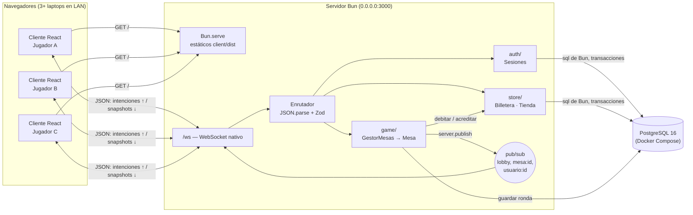
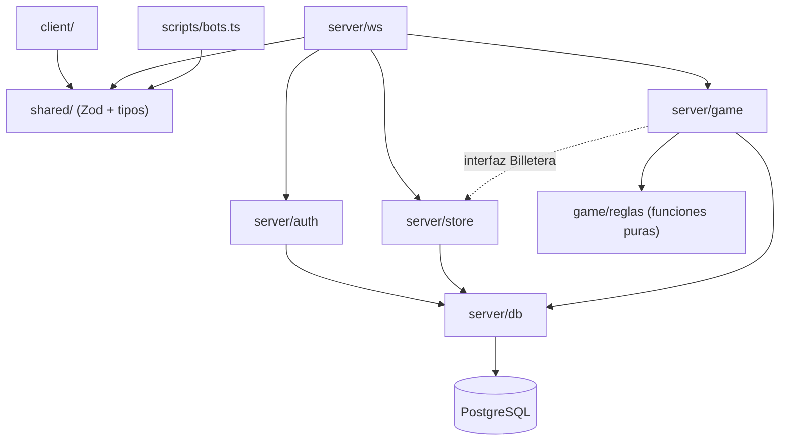
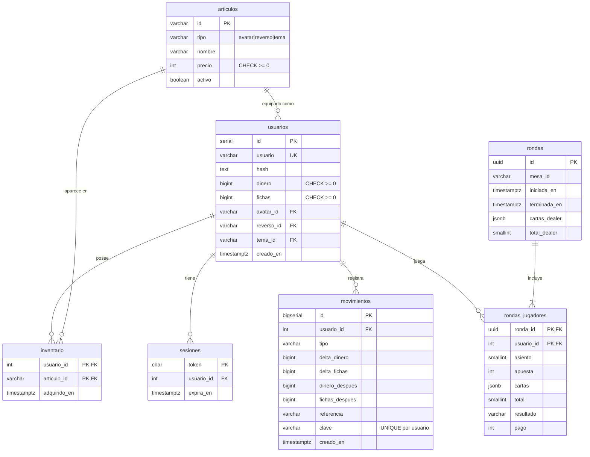
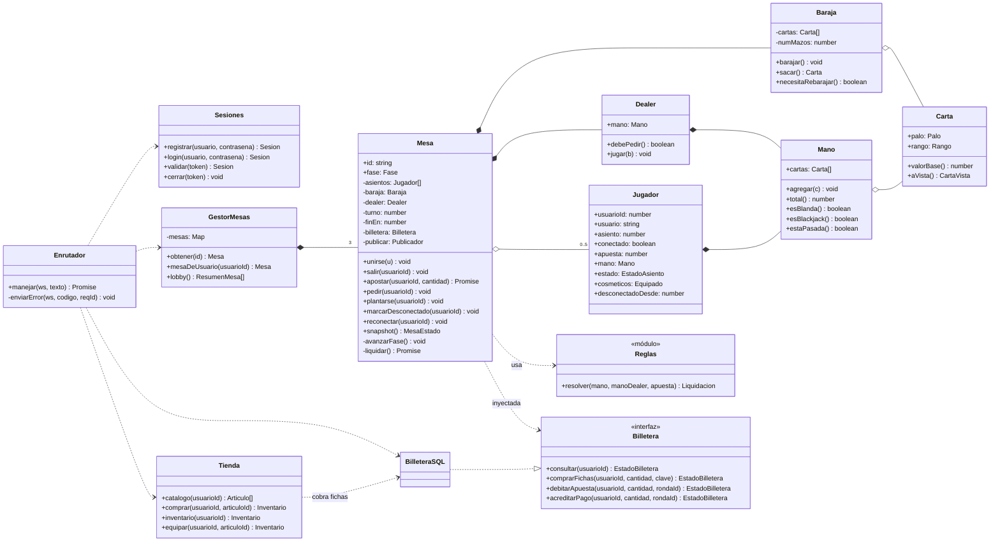
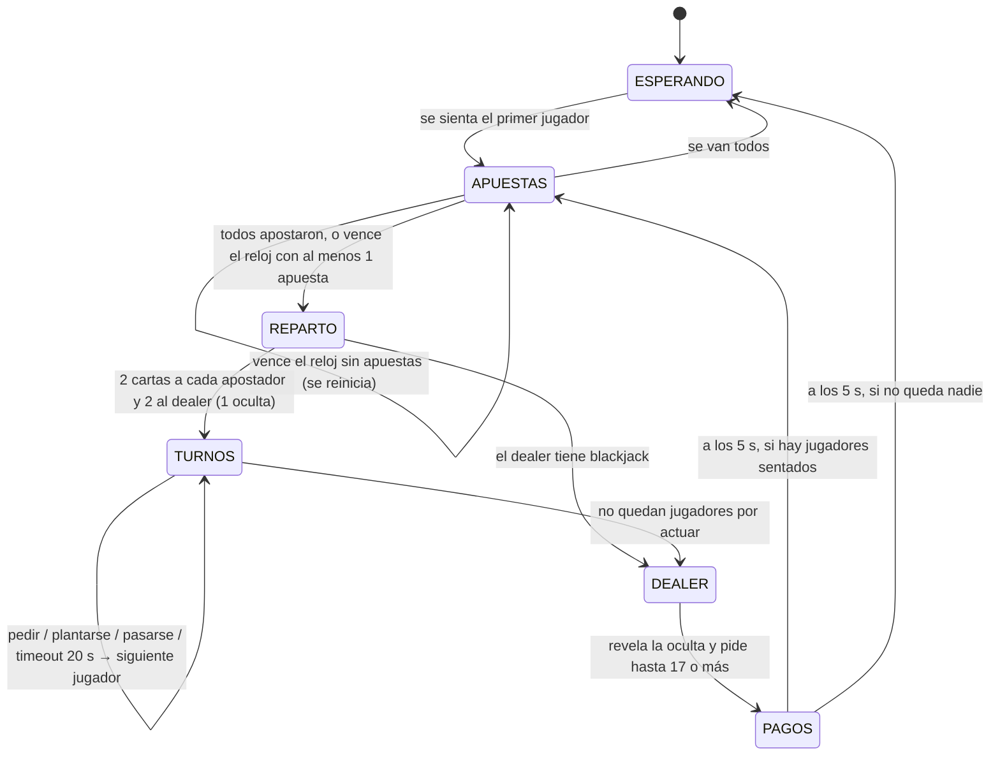

# PLAN MAESTRO — Blackjack multijugador (Proyecto Parcial 1)

> Entrega: **miércoles 7 de octubre de 2026, 13:00 (CDMX)**, en un solo `.zip`.
> Prioridad absoluta: **que funcione sin errores de validación** (50 % de la calificación). Lo que ponga eso en riesgo se corta.

Equipo:

| Dev | Rol | Dueño de |
|---|---|---|
| **Hector** | Motor del juego y servidor | `server/src/ws`, `server/src/game`, `server/src/auth`, monorepo, bots |
| **Nahum** | Cliente | `client/` completo, manual de usuario, diapositivas, video de respaldo |
| **Massimo** | Contrato, economía e integración | `shared/`, `server/db`, `server/src/store`, Docker, pruebas de economía, docs de arquitectura, manual de instalación, `.zip` |

> **Ajuste al reparto original:** el login/registro (backend) pasa a Hector porque vive en el mismo enrutador WebSocket; el monorepo inicial y el script de bots también son de Hector. Así Massimo queda con `shared/` + BD + economía + docs y los tres tienen una carga parecida (19 / 17 / 19 tareas, más 2 tareas de equipo).

---

## 1. Supuestos y valores por defecto

Todos los valores numéricos viven en `server/src/config.ts` (y los precios en `server/db/seed.sql`). Cambiarlos no requiere tocar lógica.

| Supuesto | Valor |
|---|---|
| Canal único | Todo (incluido login) va por **un WebSocket** en `/ws`. No hay API REST. |
| Demo | Varias laptops en la misma red LAN. El servidor escucha en `0.0.0.0:3000` y sirve el build del cliente. También funciona con 3 pestañas en una sola máquina. |
| Sesión | Token aleatorio de 32 bytes (hex) guardado en `sesiones` y en `localStorage`; expira en 7 días. |
| Varias pestañas | Se permiten varias conexiones por usuario, pero **un solo asiento**. Si otra pestaña entra a la mesa, toma el asiento y la anterior pasa a espectadora. |
| Dinero inicial | $10,000 (dinero simulado) |
| Fichas de bienvenida | 500 fichas al registrarse (para poder jugar de inmediato en la demo) |
| Tasa | 1 $ = 1 ficha |
| Límite diario de compra | 5,000 fichas por usuario, día natural en `America/Mexico_City` (se reinicia a las 00:00 CDMX) |
| Compra por operación | 10 a 5,000 fichas, múltiplo de 10 |
| Apuesta | 10 a 500 fichas, **múltiplo de 10** (así el pago 3:2 siempre es entero) |
| Mesas | 3 mesas fijas (definidas en config), 5 asientos cada una |
| Baraja | 4 mazos (208 cartas), se rebaraja al inicio de ronda si quedan < 25 % |
| Dealer | Pide con 16 o menos, se planta en **todo 17** (incluido 17 blando) |
| Pagos | Gana 1:1 · Blackjack natural 3:2 · Empate devuelve la apuesta · Blackjack del dealer gana a todo excepto a otro blackjack (empate) |
| Tiempos | Apuestas 15 s · Turno 20 s · Pantalla de resultados 5 s |
| Desconexión | Asiento reservado 60 s. Si le toca turno desconectado, se planta automáticamente. |
| Catálogo | 4 avatares (100–300 fichas), 4 reversos (150–400), 3 temas (500–1,000) + 3 gratuitos (avatar, reverso y tema básicos) que se entregan y equipan al registrarse |
| Validación | **Zod** en `shared/`: el mismo esquema genera el tipo TS y valida en runtime |
| Estado de mesa | El servidor manda un **snapshot completo** (`mesa.estado`) tras cada cambio. Los relojes son del servidor (`finEn` = timestamp); el cliente solo dibuja la cuenta regresiva. |
| Fichas en juego | Se **descuentan al apostar** (transacción + movimiento) y se acreditan al pagar. Si el servidor se cae a media mano, no se "crean" fichas. |

### Catálogo por defecto (`seed.sql`)

| id | tipo | nombre | precio |
|---|---|---|---|
| `avatar_basico` | avatar | Básico | 0 |
| `avatar_gato` | avatar | Gato | 100 |
| `avatar_robot` | avatar | Robot | 150 |
| `avatar_pirata` | avatar | Pirata | 200 |
| `avatar_corona` | avatar | Corona | 300 |
| `reverso_clasico` | reverso | Clásico azul | 0 |
| `reverso_rojo` | reverso | Rojo casino | 150 |
| `reverso_neon` | reverso | Neón | 250 |
| `reverso_oro` | reverso | Oro | 300 |
| `reverso_pixel` | reverso | Pixel art | 400 |
| `tema_verde` | tema | Paño verde | 0 |
| `tema_azul` | tema | Paño azul | 500 |
| `tema_rojo` | tema | Paño vino | 750 |
| `tema_noche` | tema | Noche | 1000 |

**Visibilidad de cosméticos:** el avatar se ve en el asiento para todos; el reverso del jugador se ve en sus cartas durante la animación de reparto (para todos); el tema de mesa es **local** (solo cambia cómo la ve quien lo equipó).

---

## 2. Arquitectura



Principios (también en `CLAUDE.md`):

1. **El servidor es la única fuente de verdad.** El cliente manda intenciones y dibuja snapshots.
2. **`shared/`** contiene los esquemas Zod y tipos de todos los mensajes (uniones discriminadas por `type`).
3. **Todo mensaje entrante se valida** con Zod; si falla → `error` con código, nunca una excepción sin atrapar.
4. **Partidas en curso en memoria**; Postgres guarda usuarios, dinero, compras, inventario y rondas terminadas.
5. **Dinero y fichas son enteros** (`bigint`/`int` en SQL, `z.number().int()` en TS).
6. **Toda operación de dinero en transacción** con `SELECT … FOR UPDATE` sobre la fila del usuario y registro en `movimientos`.

### Topics de pub/sub

| Topic | Quién se suscribe | Qué se publica |
|---|---|---|
| `lobby` | Conexiones del lobby (sin autenticacion en T-06; T-08 incorpora sesiones) | `bienvenida` (conteo de conexiones, T-06) y `lobby` (ocupación de mesas) |
| `mesa:<id>` | Jugadores y espectadores de esa mesa | `mesa.estado`, `ronda.resultado` |
| `usuario:<id>` | Todas las pestañas de ese usuario | `billetera`, `inventario` (ambas pestañas ven el mismo saldo) |

### Estructura del monorepo

```
blackjack/
├── package.json         # workspaces: server, client, shared; scripts raíz
├── docker-compose.yml   # solo Postgres
├── .env.example
├── server/
│   ├── src/
│   │   ├── index.ts     # Bun.serve (HTTP + WS)
│   │   ├── config.ts    # valores por defecto
│   │   ├── ws/          # enrutador, contexto de conexión, envío de errores
│   │   ├── auth/        # Sesiones (registro, login, reanudar)
│   │   ├── game/        # Carta, Baraja, Mano, Jugador, Dealer, Mesa, GestorMesas, reglas
│   │   ├── store/       # Billetera, Tienda
│   │   └── db/          # conexión y helper de transacciones
│   ├── db/              # schema.sql, seed.sql, consultas.sql
│   └── test/
├── client/              # React + Vite + TS + Tailwind
│   └── src/{net,state,screens,components,mock}
├── shared/              # protocolo.ts (Zod), errores.ts, tipos.ts
├── scripts/             # bots.ts, empaquetar.ts, db-reset.ts
└── docs/                # manuales, arquitectura, diagramas, exposición
```

### Diagrama de dependencias entre módulos



`game/` no importa `store/` directamente: recibe un objeto que cumple la interfaz `Billetera` (inyección de dependencias). Así las clases del juego se prueban con una billetera falsa en memoria y Hector no espera a Massimo.

---

## 3. Protocolo de mensajes

Formato: JSON de texto. Todo mensaje del cliente puede llevar `reqId?: string` (máx. 36 caracteres); el servidor lo repite en la respuesta directa o en el `error`. Límite de tamaño: 16 KB por mensaje. Límite de ritmo: 20 mensajes/s por conexión.

### 3.1 Cliente → Servidor

| `type` | Campos | Sesión | Fase / condición válida | Respuesta | Errores posibles |
|---|---|---|---|---|---|
| `registro` | `usuario` (3–20, `[A-Za-z0-9_]`), `contrasena` (6–72) | No | Sin sesión | `sesion` | `MENSAJE_INVALIDO`, `USUARIO_EXISTE`, `YA_AUTENTICADO` |
| `login` | `usuario`, `contrasena` | No | Sin sesión | `sesion` | `MENSAJE_INVALIDO`, `CREDENCIALES_INVALIDAS`, `YA_AUTENTICADO` |
| `reanudar` | `token` (64 hex) | No | Sin sesión | `sesion` (+ `mesa.estado` si tenía asiento) | `SESION_INVALIDA` |
| `logout` | — | Sí | Cualquiera (si está en mano, se planta) | `ok` | `NO_AUTENTICADO` |
| `lobby.listar` | — | Sí | Cualquiera | `lobby` | `NO_AUTENTICADO` |
| `mesa.unirse` | `mesaId` | Sí | Cualquier fase; si la ronda ya empezó, queda "esperando próxima ronda" | `mesa.estado` | `MESA_NO_EXISTE`, `MESA_LLENA`, `YA_EN_OTRA_MESA` |
| `mesa.salir` | — | Sí | Sentado. Con mano activa: se planta y el asiento se libera al terminar la ronda | `ok` + `lobby` | `NO_ESTAS_EN_MESA` |
| `apostar` | `cantidad` (entero, 10–500, múltiplo de 10) | Sí | Mesa en `APUESTAS`, sentado, sin apuesta en la ronda | `mesa.estado` (a la mesa) + `billetera` | `FASE_INCORRECTA`, `NO_ESTAS_EN_MESA`, `YA_APOSTASTE`, `CANTIDAD_INVALIDA`, `FICHAS_INSUFICIENTES` |
| `pedir` | — | Sí | Mesa en `TURNOS` y `turnoDe` = este usuario | `mesa.estado` | `FASE_INCORRECTA`, `NO_ES_TU_TURNO`, `NO_ESTAS_EN_MESA` |
| `plantarse` | — | Sí | Igual que `pedir` | `mesa.estado` | `FASE_INCORRECTA`, `NO_ES_TU_TURNO`, `NO_ESTAS_EN_MESA` |
| `billetera.consultar` | — | Sí | Cualquiera | `billetera` | `NO_AUTENTICADO` |
| `fichas.comprar` | `cantidad` (entero, 10–5,000, múltiplo de 10), `clave` (UUID nuevo por cada clic) | Sí | Cualquiera (no altera la mesa) | `billetera` | `CANTIDAD_INVALIDA`, `DINERO_INSUFICIENTE`, `LIMITE_DIARIO` |
| `tienda.catalogo` | — | Sí | Cualquiera | `catalogo` | `NO_AUTENTICADO` |
| `tienda.comprar` | `articuloId` | Sí | Cualquiera | `inventario` + `billetera` | `ARTICULO_NO_EXISTE`, `YA_POSEIDO`, `FICHAS_INSUFICIENTES` |
| `inventario.listar` | — | Sí | Cualquiera | `inventario` | `NO_AUTENTICADO` |
| `inventario.equipar` | `articuloId` | Sí | No sentado, o mesa en `ESPERANDO`/`APUESTAS` | `inventario` (+ `mesa.estado` a la mesa) | `NO_POSEIDO`, `ARTICULO_NO_EXISTE`, `BLOQUEADO_EN_MANO` |
| `movimientos.listar` | `limite?` (1–100, def. 50), `antesDe?` (id) | Sí | Cualquiera | `movimientos` | `MENSAJE_INVALIDO` |
| `ping` | — | No | Cualquiera | `pong` | — |

Mensaje que requiere sesión y llega sin ella → `NO_AUTENTICADO`. JSON inválido, `type` desconocido, campos extra o estructura mal formada → `MENSAJE_INVALIDO`. Excepción de cantidades: en `apostar` y `fichas.comprar`, si `cantidad` está presente y es el único campo inválido (incluyendo una cadena como `"abc"`), se devuelve `CANTIDAD_INVALIDA`, conforme a T-20. Una cantidad faltante o una petición con otros errores conserva `MENSAJE_INVALIDO`. El enrutador usa `crearErrorValidacion(entrada, resultado.error)` de `shared/` para aplicar esta prioridad y reflejar solo un `reqId` válido.

`MensajeClienteSchema` contiene los límites por defecto del PLAN. Si se modifican los valores centrales de `server/src/config.ts`, el enrutador debe construir su esquema con `crearMensajeClienteSchema({ apuestaMin: APUESTA_MIN, apuestaMax: APUESTA_MAX, compraMin: COMPRA_FICHAS_MIN, compraMax: COMPRA_FICHAS_MAX, multiplo: MULTIPLO_FICHAS })`. Así cliente y servidor usan la misma definición sin que `shared/` importe código del servidor. Los límites de tamaño y ritmo corresponden al transporte T-07/T-37.

### 3.2 Servidor → Cliente

| `type` | Campos | Cuándo |
|---|---|---|
| `bienvenida` | `conectados` (entero >= 0) | Al abrir o cerrar una conexion /ws; conteo de sockets, no de usuarios, en topic `lobby` (T-06) |
| `sesion` | `token`, `usuario: {id, usuario}`, `billetera`, `equipado: {avatar, reverso, tema}`, `mesaId: string \| null` | Tras `registro`, `login`, `reanudar` |
| `lobby` | `mesas: [{id, nombre, ocupados, capacidad, fase}]` | Al pedirlo y cuando cambia la ocupación (topic `lobby`) |
| `mesa.estado` | `type` + campos de `MesaEstado` en la raíz (ver §3.3); sin propiedad `estado` | Tras cada cambio de la mesa (topic `mesa:<id>`) |
| `ronda.resultado` | `rondaId`, `dealer: {cartas, total}`, `resultados: [{usuarioId, resultado, apuesta, pago}]` | Al entrar a `PAGOS` |
| `billetera` | `dinero`, `fichas`, `compradoHoy`, `disponibleHoy`, `limiteDiario`, `reinicioEn` (ISO) | Tras cualquier operación de dinero (topic `usuario:<id>`) |
| `catalogo` | `articulos: [{id, tipo, nombre, precio, poseido}]` | Al pedirlo |
| `inventario` | `articulos: [{id, tipo, nombre, precio}]` (solo poseídos; sin `poseido`), `equipado: {avatar, reverso, tema}` | Al pedirlo, al comprar o equipar |
| `movimientos` | `items: [{id, tipo, deltaDinero, deltaFichas, dineroDespues, fichasDespues, referencia, creadoEn}]`, `hayMas` | Al pedirlo |
| `ok` | `reqId?` | Confirmación sin datos |
| `error` | `codigo`, `mensaje` (en español, para mostrar), `reqId?` | Cualquier validación fallida |
| `pong` | `t` (timestamp del servidor) | Respuesta a `ping` |

Todos los mensajes del servidor aceptan `reqId?` para correlacionar respuestas directas; las publicaciones a un topic lo omiten. `sesion.billetera` contiene los seis campos de la respuesta `billetera`, sin `type` ni `reqId`. `sesion.usuario.id`, `turnoDe` y `usuarioId` son enteros positivos; los identificadores de artículos equipados son strings del catálogo. `movimientos.items[].id` y `movimientos.listar.antesDe` son strings decimales positivos sin ceros iniciales, hasta `9223372036854775807` (`bigserial`), para conservar precisión. `referencia` es string de hasta 80 caracteres o `null`; `creadoEn` y `reinicioEn` son ISO 8601 con zona horaria. Los saldos y deltas deben ser enteros seguros de JavaScript; un bigint SQL que no pueda convertirse exactamente se rechaza con `ERROR_INTERNO`.

`disponibleHoy = max(0, limiteDiario - compradoHoy)`, incluso si se reduce el límite después de compras previas. `movimientos.listar.limite` se aplica como 50 al parsear si se omite; el cursor exclusivo de la próxima página es el último `items[].id` recibido. `resultado` usa `blackjack | gana | empate | pierde | pasado`; `pago` es el total devuelto incluida la apuesta. Los mensajes, artículos y snapshots rechazan campos desconocidos.

### 3.3 `MesaEstado` (snapshot)

```ts
type MesaEstado = {
  id: string; nombre: string;
  fase: "ESPERANDO" | "APUESTAS" | "REPARTO" | "TURNOS" | "DEALER" | "PAGOS";
  finEn: number | null;          // epoch ms en que vence el reloj de la fase o del turno
  turnoDe: number | null;        // usuarioId con el turno
  dealer: { cartas: CartaVista[]; total: number | null };  // total null mientras hay carta oculta
  asientos: Array<null | {
    indice: 0 | 1 | 2 | 3 | 4; usuarioId: number; usuario: string;
    avatar: string; reverso: string; conectado: boolean;
    apuesta: number;             // 0 si no apostó
    cartas: CartaVista[]; total: number;
    estado: "ESPERANDO_RONDA" | "SIN_APUESTA" | "APOSTADO" | "JUGANDO" | "PLANTADO" | "PASADO" | "BLACKJACK";
  }>;
};
type CartaVista =
  | { palo: "♠" | "♥" | "♦" | "♣"; rango: "A" | "2" | "3" | "4" | "5" | "6" | "7" | "8" | "9" | "10" | "J" | "Q" | "K" }
  | { oculta: true };
```

La carta oculta del dealer **nunca** viaja al cliente antes de la fase `DEALER` (evita trampas inspeccionando la red). Antes de `DEALER`, hay como máximo una carta visible del dealer; cualquier carta oculta contiene exclusivamente `{oculta:true}` y obliga a `total:null`. En `DEALER` y `PAGOS`, sus cartas están reveladas. Las cartas del jugador siempre están reveladas en el snapshot; el reverso es presentación durante el reparto. `asientos` contiene exactamente cinco posiciones (vacías como `null`); `indice` coincide con su posición en el arreglo.

### 3.4 Códigos de error

| Código | Significado |
|---|---|
| `MENSAJE_INVALIDO` | JSON mal formado, `type` desconocido, campos faltantes o de tipo incorrecto, mensaje > 16 KB |
| `DEMASIADAS_SOLICITUDES` | > 20 mensajes/s |
| `NO_AUTENTICADO` / `YA_AUTENTICADO` | Falta sesión / ya hay sesión en esta conexión |
| `USUARIO_EXISTE` / `CREDENCIALES_INVALIDAS` / `SESION_INVALIDA` | Autenticación |
| `MESA_NO_EXISTE` / `MESA_LLENA` / `YA_EN_OTRA_MESA` / `NO_ESTAS_EN_MESA` | Asientos |
| `FASE_INCORRECTA` / `NO_ES_TU_TURNO` / `YA_APOSTASTE` | Flujo del juego |
| `CANTIDAD_INVALIDA` | Cantidad presente de tipo incorrecto, cero, negativo, decimal, no múltiplo de 10, fuera de rango (si es el único error estructural) |
| `FICHAS_INSUFICIENTES` / `DINERO_INSUFICIENTE` / `LIMITE_DIARIO` | Economía |
| `ARTICULO_NO_EXISTE` / `YA_POSEIDO` / `NO_POSEIDO` / `BLOQUEADO_EN_MANO` | Tienda / inventario |
| `ERROR_INTERNO` | Excepción no prevista (se registra en consola; la conexión sigue viva) |

---

## 4. Base de datos

### 4.1 Tablas

**`usuarios`**

| Columna | Tipo | Restricciones |
|---|---|---|
| `id` | `serial` | PK |
| `usuario` | `varchar(20)` | `UNIQUE NOT NULL`, `CHECK (usuario ~ '^[A-Za-z0-9_]{3,20}$')` |
| `hash` | `text` | `NOT NULL` (salida de `Bun.password.hash`, argon2id) |
| `dinero` | `bigint` | `NOT NULL DEFAULT 10000`, `CHECK (dinero >= 0)` |
| `fichas` | `bigint` | `NOT NULL DEFAULT 0`, `CHECK (fichas >= 0)` |
| `avatar_id` / `reverso_id` / `tema_id` | `varchar(40)` | `FK → articulos(id)`; tipo correcto y posesión se validan en código |
| `creado_en` | `timestamptz` | `NOT NULL DEFAULT now()` |

**`sesiones`**: `token char(64) PK` · `usuario_id int NOT NULL FK → usuarios ON DELETE CASCADE` · `creado_en timestamptz DEFAULT now()` · `expira_en timestamptz NOT NULL`.

**`articulos`**: `id varchar(40) PK` · `tipo varchar(10) NOT NULL CHECK (tipo IN ('avatar','reverso','tema'))` · `nombre varchar(60) NOT NULL` · `precio int NOT NULL CHECK (precio >= 0)` · `activo boolean NOT NULL DEFAULT true`.

**`inventario`**: `usuario_id FK → usuarios ON DELETE CASCADE` · `articulo_id FK → articulos` · `adquirido_en timestamptz DEFAULT now()` · **PK (`usuario_id`, `articulo_id`)** → imposible poseer dos veces el mismo artículo aunque falle la validación en código.

**`movimientos`** (libro contable: solo se inserta, nunca se actualiza ni se borra)

| Columna | Tipo | Restricciones |
|---|---|---|
| `id` | `bigserial` | PK |
| `usuario_id` | `int` | `NOT NULL FK → usuarios` |
| `tipo` | `varchar(20)` | `CHECK (tipo IN ('registro','compra_fichas','apuesta','pago','compra_articulo'))` |
| `delta_dinero` | `bigint` | `NOT NULL DEFAULT 0` |
| `delta_fichas` | `bigint` | `NOT NULL DEFAULT 0`; `CHECK (delta_dinero <> 0 OR delta_fichas <> 0)` |
| `dinero_despues` / `fichas_despues` | `bigint` | `NOT NULL`, `CHECK (>= 0)` |
| `referencia` | `varchar(80)` | `ronda:<uuid>` o `articulo:<id>` |
| `clave` | `varchar(64)` | Clave de idempotencia de `fichas.comprar` |
| `creado_en` | `timestamptz` | `NOT NULL DEFAULT now()` |

Índices: `(usuario_id, tipo, creado_en)` para límite diario e historial; `UNIQUE (usuario_id, clave) WHERE clave IS NOT NULL` para que un doble clic no cobre dos veces.

**`rondas`**: `id uuid PK` (generado en memoria al iniciar la ronda) · `mesa_id varchar(20) NOT NULL` · `iniciada_en`, `terminada_en timestamptz NOT NULL` · `cartas_dealer jsonb NOT NULL` · `total_dealer smallint NOT NULL`.

**`rondas_jugadores`**: `ronda_id uuid FK → rondas` · `usuario_id int FK → usuarios` · `asiento smallint CHECK (asiento BETWEEN 0 AND 4)` · `apuesta int CHECK (apuesta > 0)` · `cartas jsonb` · `total smallint` · `resultado varchar(10) CHECK (resultado IN ('blackjack','gana','empate','pierde','pasado'))` · `pago int CHECK (pago >= 0)` (total devuelto, incluida la apuesta) · **PK (`ronda_id`, `usuario_id`)**.

### 4.2 Diagrama ER



### 4.3 Compra de fichas con límite diario (transacción de referencia)

```sql
BEGIN;
-- 1. Bloquea la fila: dos pestañas del mismo usuario quedan en fila, no en paralelo.
SELECT dinero, fichas FROM usuarios WHERE id = $usuario FOR UPDATE;

-- 2. Idempotencia: si esta clave ya se usó, se responde el saldo actual sin cobrar.
SELECT 1 FROM movimientos WHERE usuario_id = $usuario AND clave = $clave;

-- 3. Lo comprado hoy, con el día calculado en hora de CDMX.
SELECT COALESCE(SUM(delta_fichas), 0) AS comprado_hoy
FROM movimientos
WHERE usuario_id = $usuario
  AND tipo = 'compra_fichas'
  AND creado_en >= (date_trunc('day', now() AT TIME ZONE 'America/Mexico_City')
                    AT TIME ZONE 'America/Mexico_City');

-- 4. (En TS) validar: comprado_hoy + cantidad <= LIMITE_DIARIO y dinero >= cantidad * TASA.
UPDATE usuarios SET dinero = dinero - $costo, fichas = fichas + $cantidad
WHERE id = $usuario RETURNING dinero, fichas;

INSERT INTO movimientos (usuario_id, tipo, delta_dinero, delta_fichas,
                         dinero_despues, fichas_despues, clave)
VALUES ($usuario, 'compra_fichas', -$costo, $cantidad, $dinero, $fichas, $clave);
COMMIT;
```

`reinicioEn` = inicio del día CDMX + 1 día. Apostar, pagar y comprar artículos siguen el mismo patrón (bloqueo → validación → `UPDATE` → `INSERT` en `movimientos`). Los `CHECK (>= 0)` son la última red de seguridad si la validación en código fallara.

---

## 5. Diagrama de clases



---

## 6. Máquina de estados de la mesa



Reglas clave:

- En `TURNOS` se saltan los jugadores con blackjack y los desconectados (se plantan automáticamente).
- En `PAGOS` se liquida en BD (movimientos), se guardan `rondas`/`rondas_jugadores` y se liberan asientos de quienes salieron o llevan más de 60 s desconectados.
- Quien se sienta a media ronda queda en `ESPERANDO_RONDA` hasta la siguiente fase de `APUESTAS`.
- Todas las transiciones las dispara el servidor (acción válida o reloj). Hay **un solo reloj por mesa**, que se cancela en cada transición. Cada transición publica un `mesa.estado`.
- Si todos los apostadores se pasan, el dealer revela y no pide más.

---

## 7. Desconexión y varias pestañas

1. Al cerrarse el socket: `Mesa.marcarDesconectado(usuarioId)` → `conectado = false`. Si era su turno, se planta en ese momento; si su turno llega después, se planta al llegar.
2. En `APUESTAS` sin apuesta: no juega esa ronda. Si ya apostó, su apuesta sigue y se liquida normalmente.
3. Si se reconecta (`reanudar` con su token) dentro de 60 s: recupera el asiento y recibe el snapshot actual.
4. Después de 60 s desconectado, el asiento se libera al terminar la ronda en curso.
5. Si el mismo usuario entra a la mesa desde otra pestaña, esa conexión se vuelve la dueña del asiento; la anterior queda como espectadora (recibe snapshots, pero sus acciones responden `NO_ESTAS_EN_MESA`).

---

## 8. Cronograma día por día

| Día | Hector (juego/servidor) | Nahum (cliente) | Massimo (contrato/economía) | Hito |
|---|---|---|---|---|
| **Mar 29 sep** (hoy) | Repo en GitHub con `main` protegida (T-02) y monorepo (T-01) | Leer `PLAN.md` §3 y bocetar pantallas | Empezar contrato `shared/` (T-03) | — |
| **Mié 30 sep** | Servidor WS, enrutador, login y lobby (T-06…T-09) | Vite, cliente WS, mock, login y lobby (T-10…T-13) | `shared/` final, Docker, `schema.sql`, `seed.sql`, README (T-03…T-05, T-14) | **Hito 1**: login y 3 pestañas en el lobby |
| **Jue 1 oct** | Carta, Baraja, Mano, Dealer, reglas + tests (T-15…T-17) | Componentes de carta y asiento; mesa con mock (T-27, T-28) | Conexión BD + interfaz `Billetera` (T-22), débitos y créditos (T-23) | — |
| **Vie 2 oct** | Máquina de estados y timers (T-18, T-19); acciones (T-20) | Mesa conectada, resultados y errores (T-28, T-29) | Compra de fichas con límite (T-24), tests de economía (T-25) | — |
| **Sáb 3 oct** | Guardar ronda (T-21), bots (T-26) | Panel de billetera (T-30), guion de exposición v1 (T-33) | Integración con 3 laptops (T-31), diagramas a `docs/` (T-32) | **Hito 2**: ronda completa con 3 jugadores + compra de fichas con límite |
| **Dom 4 oct** | Desconexión/reconexión (T-36), endurecimiento (T-37), servir build (T-38) | Tienda, inventario, historial, indicador de conexión (T-39…T-42) | Tienda e inventario backend (T-34, T-35), congelamiento (T-43) | **Hito 3**: todo completo. **Congelamiento de features 22:00** |
| **Lun 5 oct** | JSDoc del servidor (T-45) + bugs | JSDoc del cliente, manual de usuario, diapositivas (T-47, T-49, T-51) | Checklist de funcionamiento (T-44), JSDoc, manual de instalación, arquitectura (T-46, T-48, T-50) | **Hito 4**: solo pruebas, bugs y docs |
| **Mar 6 oct** | Probar `.zip` en máquina limpia (T-55) | Video de respaldo (T-53) | Script del `.zip` (T-54) | **Hito 5**: 2 ensayos cronometrados (T-52, T-56) y `.zip` probado |
| **Mié 7 oct** | Laptop cargada y probada | Video en USB | Subir `.zip` **antes de las 11:00** (T-57) | **Entrega** antes de 13:00 |

Revisión diaria de 15 min (sugerido 21:00) para actualizar `ESTADO.md`.

---

## 9. Riesgos y plan B

| Riesgo | Señal temprana | Plan B |
|---|---|---|
| El WebSocket no funciona en la red de la escuela (firewall, aislamiento de clientes Wi-Fi) | En el ensayo del Hito 2 las laptops no se ven | Hotspot del celular; si falla, demo con 3+ ventanas en una laptop proyectada; video grabado (T-53) como último recurso |
| Bun SQL / Postgres da problemas | T-05 no pasa el 30 sep | Docker probado el día 1; todo el acceso a BD aislado en `server/src/db` para poder cambiarlo sin tocar el resto |
| Un dev se atrasa más de medio día | Tarea del camino crítico sin PR a las 20:00 | Se reasigna en la revisión diaria. Camino crítico: T-03 → T-07 → T-18 → T-20 → T-31 |
| El frontend espera al backend | Nahum sin servidor real | Mock del protocolo (T-12) con snapshots de todas las fases desde el día 1 |
| Condiciones de carrera en dinero | T-25 falla | `FOR UPDATE` + `CHECK >= 0` + clave de idempotencia; no se avanza sin T-25 en verde |
| Timers que "atoran" la mesa | Mesa congelada con bots | Un solo reloj por mesa; bots (T-26) jugando 10 rondas seguidas como prueba de estrés |
| La tienda no alcanza | T-34/T-39 sin terminar el dom 4 a mediodía | Aplicar criterio de corte (§10) |
| Exposición larga o leída | Ensayo 1 > 10 min | Guion con tiempos por persona, diapositivas con pocas palabras, 2 ensayos cronometrados |
| El `.zip` no arranca en otra máquina | T-55 falla | Manual paso a paso + `.env.example` + `db:reset`; se prueba el martes, no el miércoles |
| Conflictos de Git | PRs grandes | Una rama por tarea, PRs pequeños, dueños claros por carpeta |

---

## 10. Criterio de corte

Si vamos tarde, se sacrifica **en este orden** (lo primero se corta primero):

1. **Extras** (ya fuera de alcance): doblar, split, seguro, chat, ranking.
2. **Temas de mesa** (el tema queda fijo en verde).
3. **Cosméticos visibles para otros** (avatar y reverso solo se ven localmente).
4. **Tienda completa** (se oculta la tienda; el historial de movimientos se conserva).

**Nunca se cortan:** registro/login, lobby, ronda completa con 3+ jugadores, validaciones del servidor, desconexión, guardado de rondas, compra de fichas con límite diario, historial de movimientos y documentación.

## 11. Extras (fuera de alcance)

Doblar apuesta · Dividir (split) · Seguro · Chat en la mesa · Ranking global. **No se empiezan antes del congelamiento (dom 4 oct, 22:00)** y solo si el checklist de funcionamiento está completo.
